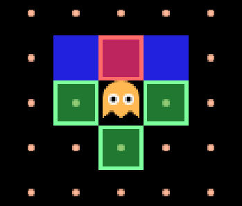

# Atelier 1 — Arbre de décision

Un arbre de décision, c’est une suite de règles « si… alors… » testées dans un ordre qui compte.
À la fin de cet atelier, ton fantôme poursuit Pac-Man.

Deux fonctions à remplir : `buildInfos`, où tu prépares les informations, et `chooseDirection`,
où tu écris les règles.

> 🛟 **Coincé ?** La page **Intro** dit quoi faire selon le temps que tu as perdu, et son
> glossaire rassemble tous les noms que le jeu te donne. Garde-la ouverte dans un onglet.

## Étape 1 — Découvrir le jeu et l’éditeur
<!-- ws: {type: exercise, id: a1-demarrer} -->

Voilà où tu vas arriver. À la fin de cet atelier, ton fantôme te poursuivra comme ça.


Un Pac-Man complet tourne déjà : 211 pac-gommes, et un fantôme qui ne bouge pas d’un pixel. C’est
la seule chose qui manque, et c’est la tienne.

### L’écran


- Contour **jaune** = le panneau qui reçoit tes touches. Clique **Code** pour écrire, **Jeu**
  pour jouer.
- Une fois la partie lancée, **Démarrer** devient **Arrêter**. C’est la pause.
- Trois fonctions dans l’éditeur. Tu ne touches pas à `updateState` aujourd’hui.
- **Écris toujours entre `function` et `end`.**


La carte est une grille, et le jeu te donne déjà `ghost.gridX` / `ghost.gridY`, `pacman.gridX` /
`pacman.gridY`, et `map.isWall(x, y)`, qui vaut `true` sur un mur.

### 🥸 Mise en application

**Ton objectif :** manger une pac-gomme, puis provoquer une erreur exprès pour savoir où le jeu
les affiche.

1. **Ouvre le panneau du jeu**, à côté de ces instructions — il est fermé au départ.
2. Clique dedans, puis sur **Démarrer**, et joue aux flèches.
3. Efface le `end` de la **ligne 3**, celui qui ferme `buildInfos`, et reclique **Démarrer**.

Tu dois obtenir ceci :


`'end' expected (to close 'function' at line 1)` : Lua dit ce qu’il attendait **et depuis quelle
ligne**. Remets le `end`, le rouge disparaît.

<!-- ws: {type: hint} -->
<details><summary>Si tu es bloqué</summary>

Les flèches ne font rien ? Le contour jaune entoure sûrement le panneau **Code**. Clique dans le
panneau **Jeu**.

</details>

## Étape 2 — Faire bouger le fantôme
<!-- ws: {type: exercise, id: a1-can-go-left} -->

Pour savoir si le fantôme peut aller à gauche, on regarde la case à sa gauche : pas de mur, on
peut y aller. À la fin de cette étape, il bouge tout seul — mal, mais tout seul.




### Boîte à outils

> **Outil #1 : `not` retourne une réponse.**
> `map.isWall(...)` dit « c’est un mur ». Ce qui t’intéresse, c’est l’inverse.
> ```lua
> pleut = true
> print(not pleut)   -- false
> ```
> 📘 [Les opérateurs logiques](https://www.lua.org/manual/5.3/manual.html#3.4.5)

> **Outil #2 : `if / then / end`, une règle en quatre morceaux.**
> ```lua
> if ilFaitFroid then
>   return 'manteau'
> end
> return nil
> ```
> `if … then` pose la question, la ligne du milieu est la réponse si c’est vrai, `end` ferme la
> règle, et `return nil` en dernier veut dire « aucune règle ne s’applique, je ne fais rien ».
> **Les apostrophes autour de `'manteau'` ne sont pas décoratives** : sans elles, Lua ne lit pas
> un mot mais une variable vide. Aucune erreur ne s’affiche, et il ne se passe rien.
> 📘 [`if / then / end`](https://www.lua.org/manual/5.3/manual.html#3.3.4)

### 🥸 Mise en application

**Ton objectif :** un fantôme qui part vers la gauche dès que la voie est libre.

Voici le modèle. Tape-le, lance-le, et garde-le sous les yeux : c’est celui que tu réutiliseras
aux étapes suivantes.

Une ligne qui commence par `--` est une **note pour toi**, pas du code : tu n’as pas besoin de
la recopier.

```lua
-- dans buildInfos, à la place de return {}
return {
  canGoLeft = not map.isWall(ghost.gridX - 1, ghost.gridY),
}
```

```lua
-- dans chooseDirection, à la place de return nil
if infos.canGoLeft then
  return 'left'
end
return nil
```

Le jeu te repasse ton `canGoLeft` dans une table nommée `infos` : tu le relis avec
`infos.canGoLeft`.

<details><summary><b>Ce que dit vraiment la ligne que tu viens de taper</b></summary>

`not map.isWall(ghost.gridX - 1, ghost.gridY)` se lit de l’intérieur vers l’extérieur :

| Le morceau | Ce qu’il dit |
| --- | --- |
| `ghost.gridX - 1` | la colonne juste **à gauche** du fantôme |
| `ghost.gridY` | sa ligne, **inchangée** — on regarde à côté, pas au-dessus |
| `map.isWall(…, …)` | « est-ce que cette case-là est un mur ? » |
| `not` | le **contraire** de la réponse |

Donc la ligne entière veut dire : **« la case à gauche n’est pas un mur »**.

</details>

Pour déplacer Pac-Man et le fantôme, attrape-les à la souris quand le jeu est **arrêté** :


**Avant de cliquer Démarrer**, réponds dans ta tête : ta règle ne parle que de la gauche. Si tu
places Pac-Man **à droite** du fantôme, est-ce qu’il ira le chercher ? Lance, et regarde si tu
avais raison.

Tu dois obtenir ceci :


<!-- ws: {type: hint} -->
<details><summary>Si tu es bloqué</summary>

Il ne bouge pas ? Trois causes, dans cet ordre : tu n’as pas recliqué **Démarrer**, ton
`return 'left'` est **après** le `end` au lieu d’être dedans, ou il manque la **virgule** après
`canGoLeft`.

</details>

## Étape 3 — Savoir de quel côté est Pac-Man
<!-- ws: {type: exercise, id: a1-distance-x} -->

Ton fantôme fonce à gauche même quand tu es à droite : il lui manque de savoir de quel côté tu es.
Une soustraction suffit.


`distanceX` **positif** : Pac-Man est à **droite**. **Négatif** : à **gauche**.

### Boîte à outils

> **Outil : `and` exige que les deux soient vraies.**
> ```lua
> if ilFaitFroid and jaiUnManteau then
>   return 'sortir'
> end
> ```
> 📘 [Les opérateurs logiques](https://www.lua.org/manual/5.3/manual.html#3.4.5)

### 🥸 Mise en application

**Ton objectif :** un fantôme qui ne va à gauche que si tu es à sa gauche.

```lua
-- dans buildInfos
return {
  canGoLeft = not map.isWall(ghost.gridX - 1, ghost.gridY),
  distanceX = pacman.gridX - ghost.gridX,
}
```

```lua
-- dans chooseDirection
if infos.canGoLeft and infos.distanceX < 0 then
  return 'left'
end
return nil
```

**Avant de lancer**, réponds dans ta tête : tu viens d’ajouter `and infos.distanceX < 0`. Si tu
places Pac-Man **au-dessus** du fantôme, est-ce qu’il montera le chercher ? Puis vérifie.

Tu dois obtenir ceci — Pac-Man à droite, le fantôme ne bouge plus :


Sauf qu’un fantôme immobile, ça peut aussi vouloir dire que ton code est cassé. Pour faire la
différence, **repose Pac-Man à gauche du fantôme et relance** : il doit repartir vers lui comme à
l’étape 2. Immobile à droite, en route à gauche — là tu es sûr de toi.

<details><summary><b>À quoi ressemble ton fichier en entier, à ce stade</b></summary>

Voilà l’ensemble, pour comparer — il ne contient rien que tu n’aies déjà tapé.

```lua
function buildInfos(ghost, pacman, map)
  return {
    canGoLeft = not map.isWall(ghost.gridX - 1, ghost.gridY),
    distanceX = pacman.gridX - ghost.gridX,
  }
end

function chooseDirection(infos, map)
  if infos.canGoLeft and infos.distanceX < 0 then
    return 'left'
  end
  return nil
end

function updateState(infos, game)
  return 'patrol'
end
```

</details>

<!-- ws: {type: hint} -->
<details><summary>Si tu es bloqué</summary>

Immobile **des deux côtés** ? Ce n’est pas ta règle, c’est ton code. Compare avec le fichier
complet ci-dessus, ligne par ligne : la virgule après `distanceX`, et le `then` en fin de `if`.

Il fonce à gauche **quoi qu’il arrive** ? Ton `and infos.distanceX < 0` n’est pas dans la même
ligne `if` que `infos.canGoLeft`.

</details>

## Étape 4 — La droite
<!-- ws: {type: exercise, id: a1-directions-completes} -->

La droite, c’est exactement la gauche dans l’autre sens : la case voisine passe de `- 1` à `+ 1`,
et la comparaison de `< 0` à `> 0`.

**N’oublie pas la virgule en fin de ligne.** Sans elle, Lua colle tes deux propriétés en une
seule et s’arrête.

### Boîte à outils

> **Outil : empiler une deuxième règle.**
> Quand tu as plusieurs règles, elles se posent **l’une après l’autre**, chacune avec son propre
> `end`, et le `return nil` reste **tout en bas**. Sur un exemple qui n’a rien à voir — choisir
> un bus :
> ```lua
> if busRougeArrive and jeVaisAuNord then
>   return 'rouge'
> end
> if busBleuArrive and jeVaisAuSud then
>   return 'bleu'
> end
> return nil
> ```
> `return nil` reste le dernier mot de la fonction : tout ce qui est écrit après lui n’est jamais
> lu.

### 🥸 Mise en application

**Ton objectif :** un fantôme qui te suit dans les deux sens sur une ligne horizontale.

```lua
-- dans buildInfos
return {
  canGoLeft = not map.isWall(ghost.gridX - 1, ghost.gridY),
  distanceX = pacman.gridX - ghost.gridX,
  canGoRight = nil, -- remplace nil par ton code
}
```

Puis **une règle de plus** dans `chooseDirection`, avant le `return nil` final, sans supprimer
celle de gauche : « si le fantôme peut aller à droite **et** que Pac-Man est à sa droite, alors il
va à droite. »

Tu dois obtenir ceci :


<!-- ws: {type: hint} -->
<details><summary>Si tu es bloqué</summary>

Il ne va toujours qu’à gauche ? Ta nouvelle règle est peut-être **après** le `return nil` : tout
ce qui suit un `return` n’est jamais lu.

`canGoRight` vaut toujours `nil` ? Recopie la ligne de `canGoLeft` et change le `- 1` en `+ 1`.

</details>

## Étape 5 — L’axe vertical
<!-- ws: {type: exercise, id: a1-haut-bas} -->

Même modèle, sur l’autre axe. Une seule différence, et c’est **le** piège de l’atelier : `gridY`
augmente vers le **bas**. Donc `distanceY` positif veut dire que Pac-Man est **en dessous**, pas
au-dessus.

Les deux directions te manquent aussi : le jeu attend `'up'` et `'down'`, écrits comme `'left'`
et `'right'`.

Fais le calcul une fois, à la main, avant d’écrire quoi que ce soit : fantôme en `(5, 3)`,
Pac-Man en `(5, 9)`. Pac-Man est **en dessous**, et `pacman.gridY - ghost.gridY` vaut `6`, donc
**positif**. Retiens ce couple : *en dessous = positif*.

### 🥸 Mise en application

**Ton objectif :** un fantôme qui te suit partout, plus seulement sur une ligne.

```lua
-- dans buildInfos
return {
  canGoLeft = not map.isWall(ghost.gridX - 1, ghost.gridY),
  distanceX = pacman.gridX - ghost.gridX,
  canGoRight = not map.isWall(ghost.gridX + 1, ghost.gridY),
  canGoUp = nil,   -- remplace nil par ton code
  canGoDown = nil, -- idem
  distanceY = nil, -- idem
}
```

Puis **deux règles de plus** dans `chooseDirection`, sur le modèle des deux que tu as déjà.

Tu dois obtenir ceci — et il ne traverse jamais un mur bleu :


<!-- ws: {type: hint} -->
<details><summary>Si tu es bloqué</summary>

Il monte quand il devrait descendre ? Relis le calcul du haut de l’étape : *en dessous =
positif*. Donc la règle « descendre » se déclenche quand `distanceY` est **positif**, et tes deux
comparaisons verticales sont à l’envers l’une de l’autre.

Une seule direction sur quatre fonctionne ? Chaque ligne finit par une **virgule**, et `canGoUp`
regarde `ghost.gridY - 1`, pas `ghost.gridX - 1`.

</details>

## Étape 6 — L’ordre des règles compte
<!-- ws: {type: exercise, id: a1-priorite-regles} -->

Quand Pac-Man est en diagonale, plusieurs de tes règles sont vraies en même temps. Le **premier
`if` qui correspond** gagne, et les suivants ne sont même pas lus.

### 🥸 Mise en application

**Ton objectif :** faire prendre au fantôme un chemin différent, sans changer une seule de tes
règles.

**D’abord**, à la souris et jeu arrêté, mets le fantôme dans un coin et Pac-Man dans le coin
opposé — le plus loin possible. Lance, et regarde **par quel axe le fantôme démarre**.

Puis, dans `chooseDirection` uniquement, échange l’ordre de tes règles horizontales et verticales.
Remets les deux exactement où ils étaient, relance, et regarde de nouveau.

Tu dois obtenir ceci — **deux trajets opposés, avec exactement les mêmes règles** :


**C’est réussi quand tu as vu les deux.** Si ton fantôme démarre du même côté avant et après,
l’échange n’a pas pris.

<!-- ws: {type: hint} -->
<details><summary>Si tu es bloqué</summary>

Aucune différence ? Tu les as sûrement laissés sur la même ligne ou la même colonne : une seule
règle est vraie, et l’ordre ne change rien. Reprends-les à la souris et mets-les vraiment dans
deux coins opposés.

</details>

## Étape 7 — Le plus court chemin
<!-- ws: {type: exercise, id: a1-optimiser-recherche} -->

Jusqu’ici tes règles sont testées dans un ordre fixé d’avance. Fais plutôt tester d’abord l’axe
où tu es **le plus loin**. C’est l’étape la plus lourde de l’atelier — prends ton temps.

### Boîte à outils

> **Outil #1 : `math.abs` retire le signe.**
> ```lua
> print(math.abs(5))    -- 5
> print(math.abs(-5))   -- 5
> ```
> Ici tu compares deux écarts : `-7` n’est pas « plus petit » que `2`, c’est 7 cases contre 2.
> Sans `math.abs`, ta comparaison répondrait le contraire de la vérité.
> 📘 [`math.abs`](https://www.lua.org/manual/5.3/manual.html#pdf-math.abs)

> **Outil #2 : `else`, le chemin d’à côté.**
> `else` dit quoi faire quand la condition est fausse. Un seul des deux blocs s’exécute, jamais
> les deux.
> ```lua
> if temperature > 25 then
>   print('on sort les glaces')
> else
>   print('on sort les parapluies')
> end
> print('dans tous les cas, on ouvre la boutique')
> ```
> Deux choses qui cassent : `else` **ne prend pas** de `then`, et il n’y a **qu’un seul `end`**
> pour les deux blocs. (Lua écrit `elseif` en un seul mot, jamais `else if`.)
> 📘 [`if / else / end`](https://www.lua.org/manual/5.3/manual.html#3.3.4)

> **Outil #3 : des règles *dans* un `else`.**
> Chaque branche d’un `if / else` peut contenir des règles entières, avec leurs propres `end`.
> Loin du fantôme, juste pour voir la forme — servir une table selon qu’il reste du plat du jour :
> ```lua
> if resteDuPlat then
>   if clientPressé then
>     return 'plat du jour'
>   end
>   if clientVégétarien then
>     return 'légumes'
>   end
> else
>   if clientPressé then
>     return 'sandwich'
>   end
>   if clientVégétarien then
>     return 'salade'
>   end
> end
> return nil
> ```
> **Compte les `end` de cet exemple : il y en a cinq.** Un par règle intérieure — il y en a
> quatre — **plus un** pour le `if / else` qui les contient, tout en bas. Et un `return`
> intérieur sort de la fonction entière, pas seulement de sa branche.

### 🥸 Mise en application

**Ton objectif :** un fantôme qui coupe en diagonale au lieu de faire un grand trait puis un
virage — et qui t’attrape nettement plus vite qu’à l’étape 6.

Oui, huit règles qui se ressemblent, c’est lourd. Mais c’est pratiquement toujours la même
chose, avec un petit bout à changer à chaque fois.

Réorganise `chooseDirection` sur cette ossature. Tu as trois choses à écrire : la comparaison
du haut, puis tes quatre règles dans chacune des deux branches. Le `end` de l’ossature est déjà
placé — tes règles, elles, gardent chacune le sien.

```lua
if nil then -- remplace nil par ta comparaison
  -- tes 4 règles, gauche / droite d'abord
else
  -- tes 4 règles, haut / bas d'abord
end
return nil
```

Tu dois obtenir ceci :


<!-- ws: {type: hint} -->
<details><summary>Si tu es bloqué</summary>

**Coupe l’étape en deux, teste au milieu.**

*Moitié 1, la comparaison seule.* `print(math.abs(infos.distanceX), math.abs(infos.distanceY))` au
début de `chooseDirection`, puis **F12** pour ouvrir la console du navigateur (sur Mac,
**Cmd + Option + J**), onglet **Console**. Ça défile : regarde la dernière ligne. Les deux nombres
bougent-ils comme tu l’attends quand tu te déplaces ?

*Moitié 2, la structure.* Tes règles marchent déjà : tu n’as **rien** à réécrire dedans. Tu les
recopies dans les deux branches, dans un ordre différent.

</details>

## Étape 8 — Jouer une partie complète
<!-- ws: {type: exercise, id: a1-partie-complete} -->

- **Victoire** : **toutes** les pac-gommes, y compris celle cachée sous le fantôme au départ.
- **Mort** : tu le touches → « **Perdu !** », et ça redémarre après 3 s.
- Les grosses pac-gommes blanches : rien pour l’instant.

### 🥸 Mise en application

**Ton objectif :** gagner une partie du début à la fin, sans erreur rouge.

Tu dois obtenir ceci — compteur à **0**, score à **2 270**. C’est le score exact d’une partie
complète : si tu as gagné, tu as forcément ce nombre-là.


**Garde une trace :** capture ton écran — les touches sont sur la page d’intro.

> **Tu n’as pas encore gagné de partie ?** Capture quand même. Un fantôme qui te poursuit, même
> imparfaitement, c’est déjà ton code qui décide.

<!-- ws: {type: hint} -->
<details><summary>Si tu es bloqué</summary>

Tu perds tout le temps ? Passe par les couloirs étroits : ton fantôme ne sait pas contourner.

Un bug revient ? Fais afficher tes variables avec `print` : commence par la ligne que tu viens
d’écrire.

</details>

## Défis bonus
<!-- ws: {type: exercise, id: a1-bonus, optional: true} -->

Quatre pistes, sans correction. Les trois premières n’utilisent que ce que tu as déjà ; la
dernière ajoute une notion. Aucune ne bloque la suite.

1. **Le fantôme prudent.** Fais-le s’arrêter net à moins de 2 cases, au lieu de foncer dedans.
   *C’est réussi si :* il se fige juste à côté de toi au lieu de te toucher.
2. **Le fantôme à contresens.** À l’étape 7 tu testes d’abord l’axe le plus **long**. Inverse :
   teste d’abord le plus **court**.
   *C’est réussi si :* depuis la même position de départ, il met visiblement plus de temps à
   t’atteindre qu’à l’étape 7.
3. **Le gardien.** Quand tu es sur la même ligne **ou** la même colonne que lui, fais-le s’arrêter
   pour te barrer la route au lieu d’avancer. Deux outils de plus : `==` teste l’égalité
   (`if infos.distanceY == 0 then` = « l’écart vertical vaut exactement zéro »), et `or` remplace
   `and` quand **une seule** des deux conditions suffit.
   *C’est réussi si :* dès que tu te places sur sa ligne, il cesse d’avancer.
4. **La règle écrite une seule fois.** À l’étape 7 tu as recopié tes quatre règles dans les deux
   branches. Une **fonction** te permet de l’écrire une fois et de t’en servir partout. C’est le
   seul défi de cette page qui demande une notion neuve — la voici, sur un exemple qui n’a rien à
   voir :

   ```lua
   function ilFaitBeau(soleil, vent)
     if soleil and vent < 20 then
       return true
     end
     return false
   end

   -- ailleurs dans le fichier, autant de fois que tu veux :
   if ilFaitBeau(true, 5) then return 'parasol' end
   ```

   Les noms entre parenthèses de la **première** ligne sont les tiens, tu les choisis ; ceux de
   l’appel sont les vraies valeurs. Écris ta fonction **en dehors** des trois autres, jamais
   dedans : le jeu lit ton fichier en entier et n’appelle que les trois qu’il connaît.
   *C’est réussi si :* ton `chooseDirection` est plus court qu’avant, et que ton fantôme se
   comporte exactement comme à l’étape 7.

Et deux questions sans réponse écrite, pour celles et ceux que ça amuse : ce fantôme est-il
vraiment *intelligent* ? Et trouves-tu une position de départ où il se coince derrière un mur
alors qu’un détour l’aurait ramené sur toi ?

## Fin de l’atelier 1

Ton fantôme poursuit Pac-Man, et c’est **ton** ordre de règles qui lui donne sa façon de chasser.

Tu vas en croiser tous les jours : **on te pose des questions dans un ordre, et cet ordre change
où tu arrives.** Un formulaire qui change selon tes réponses, les filtres
d’un site quand tu cherches des baskets — quelqu’un a choisi l’ordre des questions. Comme toi à
l’étape 6.

> **Si tu enchaînes sur l’atelier 2**, ton fantôme y gagnera trois humeurs — et la grosse
> pac-gomme blanche servira enfin à quelque chose.
