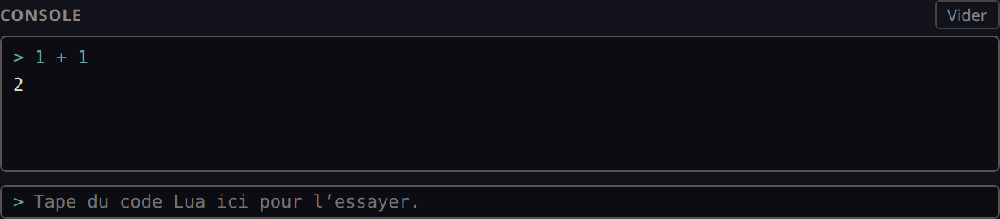
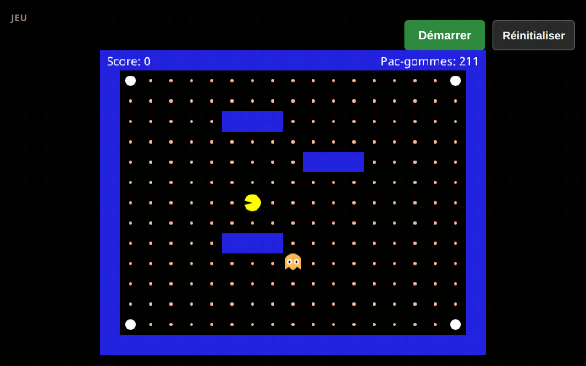
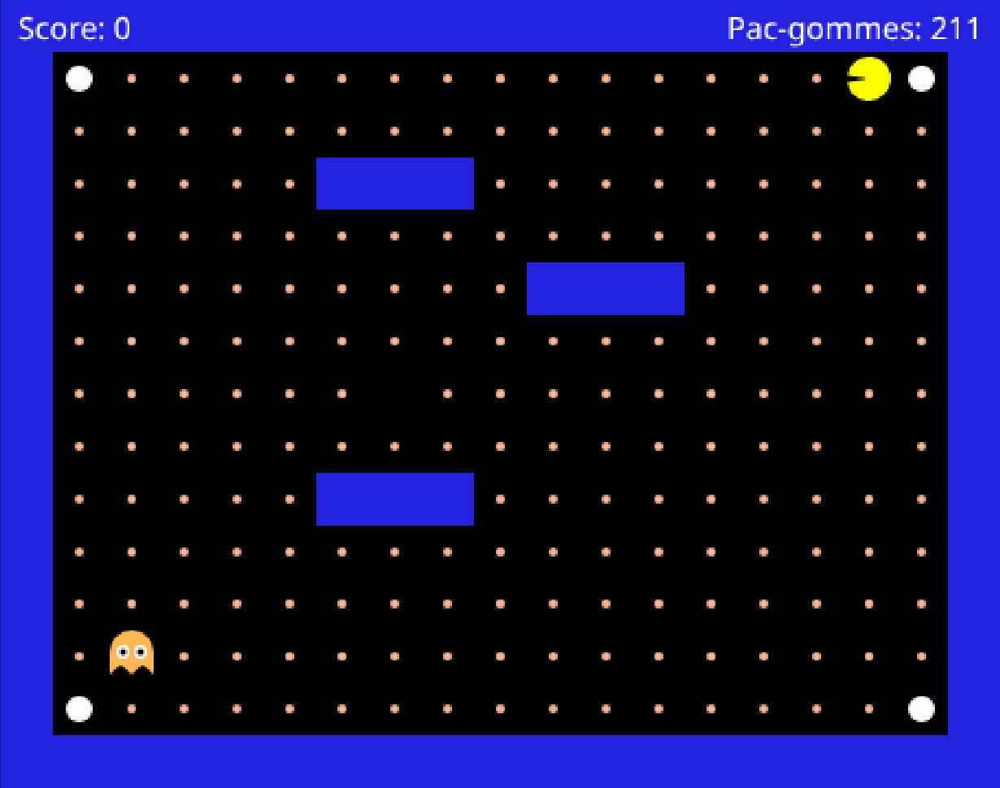

# Partie 1 : Arbre de décision

## Mise en contexte

Un arbre de décision, c'est une suite de règles « si... alors... sinon... » testées dans un ordre précis.

À la fin de cette partie, ton fantôme poursuivra Pac-Man et c'est ton arbre de décision qui lui dira comment.


## Étape 0 : Découvrir le jeu et l'éditeur
<!-- ws: {type: exercise, id: a1-demarrer, validation: quiz} -->

Le jeu fonctionne déjà en partie : Pac-Man se déplace et mange les pac-gommes. Le fantôme, lui, ne bouge pas. C'est la seule chose qui manque.

### L'écran


- Contour **jaune** = le panneau qui reçoit tes touches. Clique dans le panneau **Code** pour écrire ton code, dans le panneau **Jeu** pour tester ce que tu as codé.
- Dans l'éditeur il y a une seule fonction à remplir : `ghost`. Le jeu l'appelle **à chaque case** : quand le fantôme arrive au centre d'une case, il part dans la direction que ta fonction renvoie.
- Sous l'éditeur, la **Console** : les erreurs et les affichages du programme y sortent, et tu
  peux y taper du code toi-même pour l'essayer.
- **Écris toujours entre** `function` **et** `end`.

### 🥸 Mise en application

**Ton objectif :** démarrer le jeu sans toucher au code, déplacer Pac-Man avec les flèches de ton clavier, taper ta première ligne de code dans la **Console**, puis provoquer une erreur exprès pour voir ce que ça fait.

1. En haut de cette page, clique sur le bouton **Ouvrir Pac-Man** : le jeu s'ouvre à côté des instructions ou dans un nouvel onglet.
2. Clique dans le panneau **Jeu**, puis sur **Démarrer**, et joue une partie rapidement.
3. Clique dans la **Console**, sous l'éditeur, tape `1 + 1` et appuie sur Entrée.
4. Efface le `end` de la **ligne 3**, celui qui ferme `ghost`, puis clique **Arrêter** et **Démarrer**.

La **Console** te répond :



C'est là que tu peux essayer les exemples des **boîtes à outils** sans toucher à ton jeu. Chaque fois que tu verras ▶️ **Essaye dans la Console**, tape les lignes ici, l'une après l'autre, et regarde ce que Lua répond.

Et sans son `end`, ton code, lui, ne passe plus :


> ⚠️ `'end' expected (to close 'function' at line 1)` : Lua dit ce qu'il attendait **et depuis quelle ligne**. Remets le `end`, l'erreur disparaît.

<!-- ws: {type: hint} -->
<details><summary>Si tu es bloqué</summary>

Les flèches ne font rien ? Le contour jaune entoure sûrement le panneau **Code**. Clique dans le panneau **Jeu**.

</details>

> ✅ Bravo, ton environnement est prêt.

<!-- ws: {type: quiz, id: a1-demarrer, kind: single} -->
> Où devras-tu écrire ton code ?
- A. Dans le panneau de code entre `function ghost()` et `end`
- B. Dans le panneau de jeu
- C. Dans un fichier .lua sur mon ordinateur

## Étape 1 : Faire bouger le fantôme
<!-- ws: {type: exercise, id: a1-bouger, validation: quiz} -->

Le fantôme ne bouge pas, et c'est normal : `ghost` renvoie `nil`, ce qui veut dire « je ne fais rien ». Remplace ce `nil` par une direction, et il partira.

### Boîte à outils

> 🧰 **Outil #1 : `return` « ma réponse est... »**
> `return` donne la réponse de la fonction, et le jeu s'en sert comme direction. Il y en a quatre, et pas d'autres.
> ▶️ **Essaye dans la Console :**
> ```lua
> return 'left'   -- gauche
> return 'right'  -- droite
> return 'up'     -- haut
> return 'down'   -- bas
> ```
> Les guillemets font partie du code, et tout s'écrit en anglais et en minuscules.
> 📘 [L'instruction `return`](https://www.lua.org/manual/5.3/manual.html#3.3.4)

### 🥸 Mise en application

**Ton objectif :** un fantôme qui part vers la gauche, puis dans les trois autres directions.

Une ligne qui commence par `--` est un **commentaire pour toi**, pas du code : tu n'es pas obligé de la recopier pour que le programme fonctionne.

```lua
-- dans ghost, à la place de return nil
return 'left'
```

Tu dois obtenir ceci :


> ⚠️ **Attention :** il traverse le mur et il s'en va pour de bon. C'est logique : tu lui as dit d'aller à gauche, sans jamais regarder ce qu'il y a devant lui. Utilise le bouton **Réinitialiser**.

Maintenant essaie les trois autres : remplace `'left'` par `'right'`, puis par `'up'`, puis par `'down'`. Entre chaque essai, clique sur **Réinitialiser** puis sur **Démarrer**. Termine par `'left'` : c'est la direction sur laquelle tu vas continuer.

<!-- ws: {type: hint} -->
<details><summary>Si tu es bloqué</summary>

Il ne bouge pas du tout ? Trois causes, dans cet ordre : tu n'as pas recliqué sur **Démarrer**, ton
`return 'left'` est **après** le `end` au lieu d'être dedans, ou il manque les guillemets autour de
`left` (`Left` et `gauche` ne marchent pas non plus : c'est en anglais et en minuscules).

</details>

<!-- ws: {type: quiz, id: a1-bouger-1, kind: single} -->
> Tu veux que le fantôme parte vers le haut. Qu'est-ce que tu écris ?
- A. `return 'up'`
- B. `return up`
- C. `return 'haut'`
- D. `return 'UP'`

<!-- ws: {type: quiz, id: a1-bouger-2, kind: single} -->
> Pourquoi le fantôme traverse-t-il le mur et sort-il de l'écran ?
- A. Parce que le jeu est cassé
- B. Parce que ton code ne regarde jamais ce qu'il y a devant le fantôme
- C. Parce que `'left'` n'est pas une vraie direction

## Étape 2 : L'empêcher de traverser les murs
<!-- ws: {type: exercise, id: a1-can-go-left, validation: quiz} -->

Ton fantôme part à gauche quoi qu'il arrive. Pour qu'il s'arrête au mur, il faut d'abord qu'il regarde la case à sa gauche : s'il n'y a pas de mur, il peut y aller.


### Boîte à outils

> 🗺️ **La carte est une grille**
> 
> Le jeu te donne déjà des outils pour récupérer la position du fantôme sur cette grille (`me.X`, `me.Y`) et pour savoir si une case sur la grille est un mur : `map.isWall(x, y)`.

> 🧰 **Outil #1 : `if / then / end` « Si... alors... »**
> Avec un exemple qui n'a rien à voir avec Pac-Man.
> ▶️ **Essaye dans la Console :**
> ```lua
> ilFaitBeau = true
> if ilFaitBeau then
>   return 'sortir'
> end
> return nil
> ```
> `if ... then` pose la question, la ligne du milieu n'est exécutée que si c'est vrai, `end` ferme la
> règle, et `return nil` en dernier veut dire « aucune autre règle ne s'applique, je ne fais rien ».
> 📘 [Les structures de contrôle](https://www.lua.org/manual/5.3/manual.html#3.3.4)

> 🧰 **Outil #2 : `not` « L'inverse de »**
> `map.isWall(...)` dit « c'est un mur ». Ce qui t'intéresse, c'est l'inverse.
> ▶️ **Essaye dans la Console :**
> ```lua
> ilPleut = true
> not ilPleut   -- false
> ```
> 📘 [Les opérateurs logiques](https://www.lua.org/manual/5.3/manual.html#3.4.5)

### 🥸 Mise en application

**Ton objectif :** le même fantôme, mais qui s'arrête au mur au lieu de le traverser.

Il te faut deux choses : savoir si la case de gauche est libre, et n'aller à gauche **que si** elle l'est.

```lua
-- dans ghost, à la place de return 'left'
canGoLeft = not map.isWall(me.X - 1, me.Y)
if canGoLeft then
  return 'left'
end
```

`canGoLeft` est une **variable** : la première ligne y range une information, et la règle en dessous la lit.

`not map.isWall(me.X - 1, me.Y)` se lit : **« la case à gauche du fantôme n'est pas un mur »**.

<details><summary>En détail</summary>

Si on décompose `not map.isWall(me.X - 1, me.Y)` :

- `not` : le **contraire** de...
  - `map.isWall(..., ...)` : est-ce que cette case-là est un mur ? Quelle case ?
    - `me.X - 1` : celle qui est à gauche du fantôme, `me.Y` : la position verticale du fantôme.

</details>

Tu dois obtenir ceci :


<!-- ws: {type: hint} -->
<details><summary>Si tu es bloqué</summary>

Il sort toujours de l'écran ? Il te reste sûrement le `return 'left'` de l'étape 1 tout seul quelque
part, en dehors du `if`.

Il ne bouge plus du tout ? Vérifie le `-` de `me.X - 1` et les deux parenthèses, et que `canGoLeft`
est écrit pareil sur les deux lignes (une majuscule change tout).

</details>

<!-- ws: {type: quiz, id: a1-can-go-left-1, kind: multiple} -->
> Quelles propositions sont vraies ?
- A. `true`
- B. `not false`
- C. `not not false`
- D. `not not true`

<!-- ws: {type: quiz, id: a1-can-go-left-2, kind: single} -->
> À quelle case correspondrait `(me.X + 1, me.Y)` ?
- A. Gauche
- B. Droite
- C. Haut
- D. Bas

<!-- ws: {type: quiz, id: a1-can-go-left-3, kind: multiple} -->
> Que se passerait-il si `canGoLeft` valait `false` ?
- A. Le fantôme ira à droite
- B. Le fantôme n'ira pas à gauche
- C. Le fantôme ne bougera pas du tout
- D. Le fantôme traversera les murs

## Étape 3 : Savoir de quel côté est Pac-Man
<!-- ws: {type: exercise, id: a1-distance-x, validation: quiz} -->

Ton fantôme fonce à gauche même quand tu es à droite : il lui manque de savoir de quel côté tu es. Une soustraction suffit.


Ici il te faut une **autre variable** `distanceX` qui va stocker la distance horizontale entre le fantôme et Pac-Man.

Lorsque `distanceX` est négatif : Pac-Man est à **gauche du fantôme**.

### Boîte à outils

> 🧰 **Outil #1 : `and` exige que deux conditions soient vraies**
> ▶️ **Essaye dans la Console :**
> ```lua
> ilFaitFroid = true
> jaiUnManteau = true
> if ilFaitFroid and jaiUnManteau then
>   return 'sortir'
> end
> ```
> 📘 [Les opérateurs logiques](https://www.lua.org/manual/5.3/manual.html#3.4.5)

> 🗺️ Le jeu te donne déjà les outils pour avoir la position de Pac-Man : `pacman.X` et `pacman.Y`.

### 🥸 Mise en application

**Ton objectif :** un fantôme qui ne va à gauche **QUE SI** Pac-Man est à sa gauche, **ET** qu'il peut y aller.

```lua
-- dans ghost, sous canGoLeft
distanceX = pacman.X - me.X
```

```lua
-- puis ta règle devient
if canGoLeft and distanceX < 0 then
  return 'left'
end
```

Tu dois obtenir ceci :



Pour déplacer Pac-Man, attrape-le à la souris quand le jeu est **arrêté** :


<details><summary>À quoi ressemble ton fichier en entier, à ce stade</summary>

```lua
function ghost()
  canGoLeft = not map.isWall(me.X - 1, me.Y)
  distanceX = pacman.X - me.X

  if canGoLeft and distanceX < 0 then
    return 'left'
  end
end
```

</details>

<!-- ws: {type: hint} -->
<details><summary>Si tu es bloqué</summary>

Immobile **des deux côtés** ? Ce n'est pas ta règle, c'est ton code. Compare avec le fichier
complet ci-dessus, ligne par ligne : le `-` de `pacman.X - me.X`, et le `then` en fin de `if`.

</details>

<!-- ws: {type: quiz, id: a1-distance-x-1, kind: single} -->
> Le fantôme est en `me.X = 8`, Pac-Man est en `pacman.X = 3`. Que vaut `distanceX` ?
- A. 5
- B. -5
- C. 3
- D. 8

<!-- ws: {type: quiz, id: a1-distance-x-2, kind: multiple} -->
> Que faut-il pour que `if canGoLeft and distanceX < 0` soit vrai ?
- A. `canGoLeft` doit valoir `true`
- B. `distanceX` doit être négatif
- C. `distanceX` doit être positif
- D. Une seule des deux conditions suffit

<!-- ws: {type: quiz, id: a1-distance-x-3, kind: multiple} -->
> À quoi sert une variable, en général ?
- A. Stocker une information qui peut changer pendant que le programme tourne
- B. Stocker une direction
- C. Empêcher que le fantôme traverse le mur
- D. Simplifier le code en donnant un nom (par exemple `canGoLeft`) à une valeur (`true` ou `false`)

## Étape 4 : La droite
<!-- ws: {type: exercise, id: a1-directions-completes} -->

Pour aller à droite, c'est comme pour aller à gauche... mais dans l'autre sens.

À partir d'ici, le code ne t'est plus écrit en entier : les trois premières étapes te donnaient le
modèle, celle-ci te demande de l'adapter. Tout ce qu'il te faut est déjà dans ton fichier.

- Pour regarder ce qu'il y a à gauche de ton fantôme, tu regardes `me.X - 1`. Pour la droite ?
- Et pour savoir si Pac-Man est à gauche, tu regardes si `distanceX` est négatif. Et pour savoir s'il est à droite ?

### Boîte à outils

> 🧰 **Outil #1 : `>` « plus grand que »**
> ▶️ **Essaye dans la Console :**
> ```lua
> temperature = 35
> if temperature > 30 then
>   return 'canicule'
> end
> ```
> 📘 [Les opérateurs de comparaison](https://www.lua.org/manual/5.3/manual.html#3.4.4)

> 🧰 **Outil #2 : empiler une deuxième règle**
> Les règles se posent **l'une après l'autre**, chacune avec son propre `end`, et la nouvelle vient **sous** la précédente.
> ▶️ **Essaye dans la Console :**
> ```lua
> jaiDuTempsLibre = false
> jaiUnControle = true
> if jaiDuTempsLibre then
>   return 'jouer'
> end
> if jaiUnControle then
>   return 'reviser'
> end
> ```

### 🥸 Mise en application

**Ton objectif :** un fantôme qui te suit dans les deux sens sur une ligne horizontale.

```lua
-- dans ghost, une variable de plus, sous distanceX
canGoRight = nil -- remplace nil par ton code
```

Puis **une règle de plus**, sous celle de gauche et sans la supprimer : « si le fantôme peut aller à droite **et** que Pac-Man est à sa droite, alors il va à droite. » (en utilisant `return 'right'` ).

Tu dois obtenir ceci :


*C'est réussi si :* tu poses Pac-Man **à gauche** du fantôme et il part à gauche, **puis** à
droite et il part à droite. Vérifie les deux : avec un seul des deux essais, une règle de droite
qui compare dans le mauvais sens passe sans que ça se voie.

À ce stade ton fichier contient **deux** variables `canGo...`, **un** `distanceX` et **deux**
règles. Compte-les dans ton fichier : si le compte n'y est pas, tu sais déjà quoi chercher.

<!-- ws: {type: hint} -->
<details><summary>Si tu es bloqué</summary>

Il ne va toujours qu'à gauche ? Regarde ta ligne `canGoRight` : est-ce qu'il y reste un `nil` ?

Il ne bouge pas quand Pac-Man est à droite ? Fais le calcul avec des nombres : le fantôme est en
`me.X = 8`, Pac-Man en `pacman.X = 12`. Que vaut `distanceX` ? Relis maintenant ta nouvelle règle
avec cette valeur, morceau par morceau : est-ce qu'elle est vraie ?

</details>

## Étape 5 : L'axe vertical
<!-- ws: {type: exercise, id: a1-haut-bas} -->


Même modèle, sur l'autre axe. Une seule différence, et c'est **le** piège de la partie : `Y` augmente vers le **bas**. Donc `distanceY` positif veut dire que Pac-Man est **en dessous**, pas au-dessus.


`map.isWall` prend **d'abord la colonne, ensuite la ligne** : `map.isWall(X, Y)`. Pour regarder à gauche ou à droite, c'est donc le **premier** nombre que tu décales ; pour regarder en haut ou en bas, le **second**.

Les deux directions te manquent aussi : le fantôme réagira lorsque `ghost` renverra `'up'` et `'down'` (avec les apostrophes, exactement comme `return 'left'` et `return 'right'`).

### 🥸 Mise en application

**Ton objectif :** un fantôme qui te suit partout, plus seulement sur une ligne.

```lua
-- dans ghost, trois variables de plus, sous canGoRight
canGoUp = nil   -- remplace nil par ton code
canGoDown = nil -- idem
distanceY = nil -- idem
```

Puis **deux règles de plus**, sur le modèle des deux que tu as déjà.

Tu dois obtenir ceci :


*C'est réussi si :* tu poses Pac-Man **droit au-dessus** du fantôme et il monte, **puis** droit
**en dessous** et il descend. Vérifie les deux : avec un seul des deux essais, deux règles
verticales inversées passent sans que ça se voie.

<!-- ws: {type: hint} -->
<details><summary>Si tu es bloqué</summary>

Il monte quand il devrait descendre ? Fais le calcul avec des nombres : le fantôme est en
`me.Y = 3`, Pac-Man en `pacman.Y = 9`. Que vaut `distanceY` ? Et Pac-Man, il est au-dessus ou en
dessous du fantôme ? Relis tes deux nouvelles règles avec cette valeur.

Il ne bouge pas du tout verticalement ? Regarde tes trois nouvelles lignes : est-ce qu'il y reste
un `nil` ?

</details>

> 💡 Tu trouves que tu écris quatre fois la même chose avec un mot qui change ? C'est normal, et ça s'écrit une seule fois : le **défi #3**, en bas de cette page, te montre comment.

## Étape 6 : L'ordre des règles compte
<!-- ws: {type: exercise, id: a1-priorite-regles} -->

Quand Pac-Man est en diagonale, plusieurs de tes règles sont vraies en même temps. Le **premier** `if` **avec une condition valide** l'emporte, et les `if` suivants ne sont même pas lus.

### 🥸 Mise en application

**Ton objectif :** faire prendre au fantôme un chemin différent, sans changer une seule de tes règles.

**D'abord**, à la souris et jeu arrêté, mets le fantôme dans un coin et Pac-Man dans le coin opposé, le plus loin possible. Lance, et regarde **par quel axe (horizontal ou vertical) le fantôme démarre**.

Puis échange l'ordre de tes règles horizontales et verticales, sans toucher à tes variables. **Ne touche à rien d'autre** : laisse le fantôme et Pac-Man exactement dans les coins où tu les as posés. Si tu les déplaces aussi, le trajet changera, mais tu ne sauras pas si c'est à cause de l'ordre ou à cause de tes coins. Relance, et regarde de nouveau.

Tu dois obtenir ceci : **deux trajets opposés, avec exactement les mêmes règles** :




**C'est réussi quand tu as vu les deux**, et tu dois pouvoir le remontrer : laisse le fantôme et
Pac-Man dans leurs coins, jeu arrêté, et garde tes deux règles verticales juste au-dessus des
horizontales. Les remonter ou les redescendre rejoue les deux trajets à la demande.

Les deux trajets se ressemblent ? Déplace le fantôme d'une ou deux cases et recommence : depuis certaines cases une seule direction est libre, et l'ordre n'y change rien.

## Étape 7 : Couper en diagonale
<!-- ws: {type: exercise, id: a1-optimiser-recherche} -->

Jusqu'ici tes règles sont testées dans un ordre fixé d'avance. Teste d'abord l'axe où l'écart est **le plus grand**.

Le fantôme avance alors d'une case sur cet axe, l'écart y diminue, l'autre axe devient le plus grand, et il change d'axe à la case suivante (le fantôme bouge alors en escalier).

> ⏳ C'est l'étape la plus lourde de la partie : prends ton temps.

### Boîte à outils

> 🧰 **Outil #1 : `math.abs` retire le signe**
> ▶️ **Essaye dans la Console :**
> ```lua
> math.abs(3)    -- 3
> math.abs(-3)   -- 3
> math.abs(-7) < 2 -- false
> ```
> Et sur une variable, exactement pareil :
> ```lua
> distanceX = -7
> math.abs(distanceX)   -- 7
> ```
> Ici tu compares deux **écarts**, pas deux nombres : `-7 < 2` est vrai, mais un écart de 7 cases est plus **grand** qu'un écart de 2 cases. Tu cherches la taille de l'écart, peu importe son signe.
> 📘 [math.abs](https://www.lua.org/manual/5.3/manual.html#pdf-math.abs)

> 🧰 **Outil #2 : `else`, le chemin d'à côté**
> `else` dit quoi faire quand la condition est fausse. Un seul des deux blocs s'exécute, jamais les deux.
> ▶️ **Essaye dans la Console :**
> ```lua
> heure = 8
> if heure > 7 then
>   print('je me réveille')
> else
>   print('je dors')
> end
> print('dans tous les cas, je continue à respirer')
> ```
> Deux choses à noter : `else` **ne prend pas** de `then`, et il n'y a **qu'un seul** `end` pour les deux blocs.
> 📘 [Les structures de contrôle](https://www.lua.org/manual/5.3/manual.html#3.3.4)

> 🧰 **Outil #3 : des règles *dans* un `else`**
> Chaque branche d'un `if / else` peut contenir des règles entières, avec leurs propres `end`.
> ▶️ **Essaye dans la Console :**
> ```lua
> ilFaitBeau = true
> temperature = 35
> jaiLaClimDansLaVoiture = true
> jaiUnParapluie = false
> jaiUneVoiture = true
> if ilFaitBeau then
>   if temperature > 30 and not jaiLaClimDansLaVoiture then
>     return 'je reste chez-moi'
>   end
>   if jaiLaClimDansLaVoiture then
>     return 'sortir'
>   end
> else
>   if jaiUnParapluie then
>     return 'sortir (à pied)'
>   end
>   if jaiUneVoiture then
>     return 'sortir (en voiture)'
>   end
> end
> ```
> Change une valeur tout en haut, relance : tu obtiens une autre réponse.
> **Compte les** `end` **de cet exemple : il y en a cinq.** Un par règle intérieure, il y en a quatre, **plus un** pour le `if / else` qui les contient, tout en bas. Et un `return` intérieur sort de la fonction entière, pas seulement de sa branche.

### 🥸 Mise en application

**Ton objectif :** un fantôme qui coupe en diagonale au lieu de faire un grand trait puis un virage. Sur une cible qui ne bouge pas, ça ne change rien : même nombre de cases. Sauf que toi, tu bouges.

Oui, huit règles qui se ressemblent, c'est lourd. Mais c'est pratiquement toujours la même chose, avec un petit morceau de code à changer à chaque fois.

**Recopie** tes quatre règles dans **chacune** des deux branches de cette ossature, sous tes variables : les mêmes quatre règles des deux côtés, dans un ordre différent. C'est de là que viennent les huit. Quand tu as fini, **il ne reste plus une seule règle en dehors de l'ossature** : celles que tu avais avant sont maintenant dans les branches, pas en dessous. Le `end` de l'ossature est déjà placé, tes règles, elles, gardent chacune le sien.

```lua
if nil then -- remplace nil par ta comparaison (l'écart horizontal est plus grand que l'écart vertical)
  -- tes 4 règles, Comme l'écart horizontal est plus grand: gauche / droite d'abord
else
  -- tes 4 règles, haut / bas d'abord
end
```

Tu dois obtenir ceci (cale Pac-Man en bas à gauche de l'écran et le fantôme en haut à droite pour mieux voir les mouvements):


*C'est réussi si :* tu poses Pac-Man **exactement en diagonale** du fantôme, à autant de cases en largeur qu'en hauteur (quatre et quatre par exemple), et que le fantôme **ne fait jamais plus de deux cases de suite dans la même direction**. Compte-les. Avant cette étape il en faisait quatre d'affilée, puis tournait une fois.

<!-- ws: {type: hint} -->
<details><summary>Si tu es bloqué</summary>

**Coupe l'étape en deux, teste au milieu.**

*Moitié 1, la comparaison seule.* `print(math.abs(distanceX), math.abs(distanceY))` juste après tes variables. Les deux nombres s'affichent dans le panneau **Console**, sous l'éditeur. Ça défile : regarde la dernière ligne. Bougent-ils comme tu l'attends quand tu te déplaces ?

*Moitié 2, la structure.* Tes règles marchent déjà : tu n'as **rien** à réécrire dedans. Tu les recopies dans les deux branches, dans un ordre différent.

</details>

## Étape 8 : Jouer une partie complète
<!-- ws: {type: exercise, id: a1-partie-complete} -->

- **Victoire** : **toutes** les pac-gommes, y compris celle cachée sous le fantôme au départ.
- **Mort** : tu le touches, « **Perdu !** », et ça redémarre après 3 s.
- Les grosses pac-gommes blanches ne font rien pour l'instant.

### 🥸 Mise en application

**Ton objectif :** profite de ce que tu as fait, et gagne une partie.


> 💬 **Tu n'as pas encore gagné de partie ?** Ce n'est pas grave. Un fantôme qui te poursuit, même imparfaitement, c'est déjà ton code qui décide.

<!-- ws: {type: hint} -->
<details><summary>Si tu es bloqué</summary>

Tu perds tout le temps ? Sers-toi des trois pavés bleus : ton fantôme ne sait pas contourner, un
mur entre vous et il vient s'y coller.

Un bug revient ? Fais afficher tes variables avec `print` : le texte sort dans le panneau
**Console**, sous l'éditeur. Commence par la ligne que tu viens d'écrire.

</details>

## Défis bonus - Partie 1
<!-- ws: {type: exercise, id: a1-bonus, optional: true, requires: a1-distance-x} -->

Trois pistes, sans correction. Les deux premières n'utilisent que ce que tu as déjà ; la dernière ajoute une notion. Aucune ne bloque la suite.

### Défi #1 : Le fantôme prudent

Fais-le s'arrêter net à moins de 2 cases, au lieu de foncer dedans.

*C'est réussi si :* il se fige juste à côté de toi au lieu de te toucher.

### Défi #2 : Le gardien

Quand tu es sur la même ligne **ou** la même colonne que lui, fais-le s'arrêter pour te barrer la route au lieu d'avancer. Deux outils de plus : `==` teste l'égalité (`if distanceY == 0 then` = « l'écart vertical vaut exactement zéro »), et `or` remplace `and` quand **une seule** des deux conditions suffit.

*C'est réussi si :* dès que tu te places sur sa ligne, il cesse d'avancer.

### Défi #3 : La règle écrite une seule fois

À l'étape 7 tu as recopié tes quatre règles dans les deux branches. Une **fonction** te permet de l'écrire une fois et de t'en servir partout. C'est le seul défi de cette page qui demande une notion neuve. La voici, sur un exemple qui n'a rien à voir :

```lua
function ilFaitBeau(soleil, vent)
  if soleil and vent < 20 then
    return true
  end
  return false
end

-- ailleurs dans le fichier, autant de fois que tu veux :
if ilFaitBeau(true, 5) then return 'parasol' end
```

Les noms entre parenthèses de la **première** ligne sont les tiens, tu les choisis ; ceux de l'appel sont les vraies valeurs. Écris ta fonction **en dehors** de `ghost`, jamais dedans : le jeu lit ton fichier en entier et n'appelle que `ghost`.

*C'est réussi si :* ton `ghost` est plus court qu'avant, et que ton fantôme se comporte exactement comme à l'étape 7.

> 🤔 Et deux questions sans réponse écrite, pour celles et ceux que ça amuse : ce fantôme est-il vraiment *intelligent* ? Et trouves-tu une position de départ où il se coince derrière un mur alors qu'un détour l'aurait ramené sur toi ?

## Fin de la partie 1

Ton fantôme poursuit Pac-Man, et c'est **ton** ordre de règles qui lui donne sa façon de chasser.

Des arbres de décision, tu en croises tous les jours : **on te pose des questions dans un ordre,
et cet ordre change où tu arrives.** Un formulaire qui change selon tes réponses, les filtres
d'un site quand tu cherches des baskets, quelqu'un a choisi l'ordre des questions. Comme toi à
l'étape 6.

> ➡️ **Si tu enchaînes sur la partie 2**, ton fantôme y gagnera trois humeurs, et la grosse
> pac-gomme blanche servira enfin à quelque chose.
