# Partie 1 : Arbre de décision

Un arbre de décision, c'est une suite de règles « si... alors... sinon... » testées dans un ordre précis.

À la fin de cette partie, ton fantôme poursuivra Pac-Man et c'est ton arbre de décision qui lui dira comment.


## Étape 0 : Découvrir le jeu et l'éditeur
<!-- ws: {type: exercise, id: a1-demarrer} -->

Le jeu fonctionne déjà en partie : Pac-Man se déplace et mange les pac-gommes. Le fantôme, lui, ne bouge pas. C'est la seule chose qui manque.

### L'écran

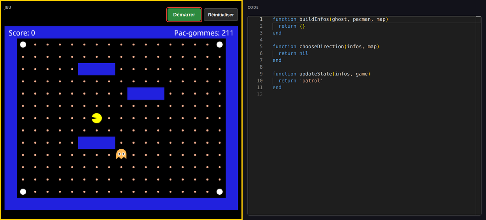

- Contour **jaune** = le panneau qui reçoit tes touches. Clique dans le panneau **Code** pour écrire ton code, dans le panneau **Jeu** pour tester ce que tu as codé.
- Dans l'éditeur il y a deux fonctions à remplir : `buildInfos`, où tu prépares ton fantôme à prendre une décision, et `chooseDirection`, où tu appliques cette décision. Tu ne touches pas à `updateState` pour l'instant.
- Sous l'éditeur, la **Console** : les erreurs et les affichages du programme y sortent, et tu
  peux y taper du code toi-même pour l'essayer, les exemples des boîtes à outils par exemple.
- **Écris toujours entre `function` et `end`.**

### 🥸 Mise en application

**Ton objectif :** démarrer le jeu sans toucher au code, déplacer Pac-Man avec les flèches de ton clavier, puis provoquer une erreur exprès pour voir ce que ça fait.

1. **Ouvre le panneau du jeu**, à côté de ces instructions, s'il n'est pas déjà ouvert.
2. Clique dedans, puis sur **Démarrer**, et joue une partie rapidement.
3. Efface le `end` de la **ligne 3**, celui qui ferme `buildInfos`, puis clique **Arrêter** et **Démarrer**.

Tu dois obtenir ceci :


`'end' expected (to close 'function' at line 1)` : Lua dit ce qu'il attendait **et depuis quelle ligne**. Remets le `end`, l'erreur disparaît.

<!-- ws: {type: hint} -->
<details><summary>Si tu es bloqué</summary>

Les flèches ne font rien ? Le contour jaune entoure sûrement le panneau **Code**. Clique dans le panneau **Jeu**.

</details>

## Étape 1 : Faire bouger le fantôme
<!-- ws: {type: exercise, id: a1-bouger} -->

Le fantôme ne bouge pas, et c'est normal : `chooseDirection` renvoie `nil`, ce qui veut dire « je ne fais rien ». Commence par lui dire d'aller à gauche.

### Boîte à outils

> **Outil : `if / then / end` « Si... alors... »**
> ```lua
> if ilFaitFroid then
>   return 'manteau'
> end
> return nil
> ```
> `if ... then` pose la question, la ligne du milieu n'est exécutée que si c'est vrai, `end` ferme la
> règle, et `return nil` en dernier veut dire « aucune autre règle ne s'applique, je ne fais rien ».
> 📘 [`if / then / end`](https://www.lua.org/manual/5.3/manual.html#3.3.4)

### 🥸 Mise en application

**Ton objectif :** un fantôme qui part vers la gauche.

Voici le modèle de code. Tape-le et lance-le : tu te baseras sur ce modèle pour la suite.

Une ligne qui commence par `--` est un **commentaire pour toi**, pas du code : tu n'es pas obligé de la recopier pour que le programme fonctionne.

```lua
-- dans buildInfos, à la place de return {}
return {
  canGoLeft = true,
}
```

```lua
-- dans chooseDirection, à la place de return nil
if infos.canGoLeft then
  return 'left'
end
return nil
```

Tu donnes l'information `canGoLeft` dans `buildInfos`.
Et tu récupères cette information dans `chooseDirection` avec `infos.canGoLeft`.

Tu dois obtenir ceci :

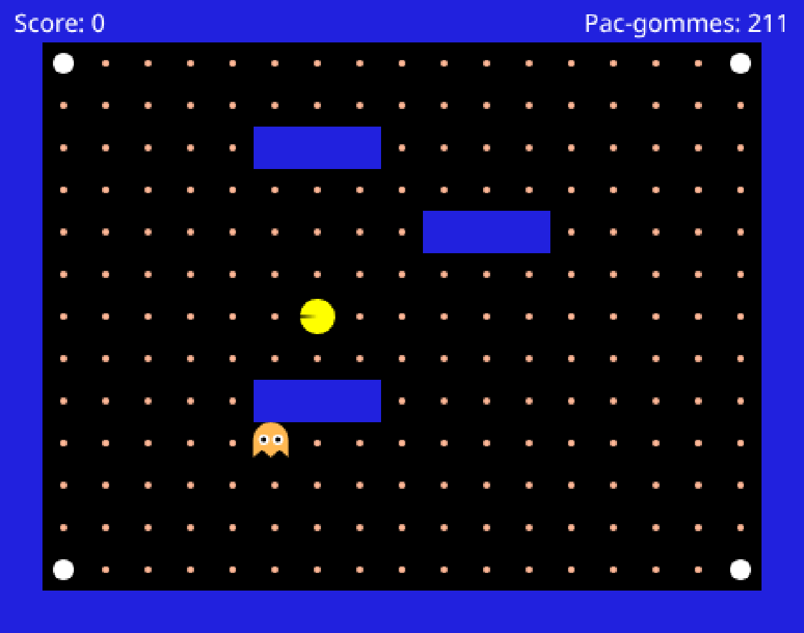

**Il traverse le mur et il s'en va pour de bon.** C'est logique : `true` veut dire « vrai, tout le temps ». Tu lui as dit qu'il pouvait aller à gauche, sans jamais regarder ce qu'il y a devant lui. Utilise le bouton **Réinitialiser**.

<!-- ws: {type: hint} -->
<details><summary>Si tu es bloqué</summary>

Il ne bouge pas du tout ? Trois causes, dans cet ordre : tu n'as pas recliqué sur **Démarrer**, ton
`return 'left'` est **après** le `end` au lieu d'être dedans, ou il manque la **virgule** après
`canGoLeft = true`.

</details>

## Étape 2 : L'empêcher de traverser les murs
<!-- ws: {type: exercise, id: a1-can-go-left} -->

Pour savoir si le fantôme peut aller à gauche, tu regardes la case à sa gauche : s'il n'y a pas de mur, il peut y aller.

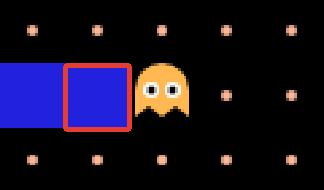

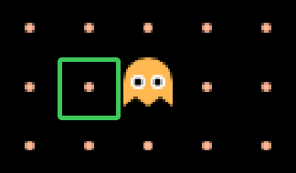


### Boîte à outils

> **La carte est une grille.**

> 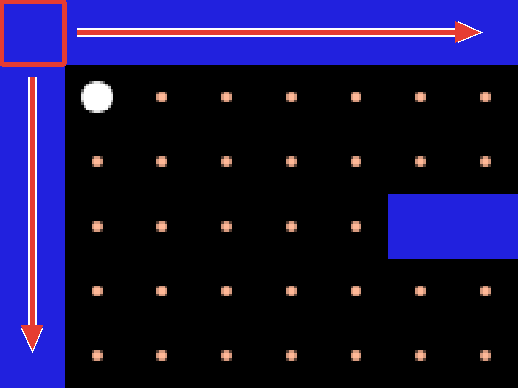

> Le jeu te donne déjà des outils pour récupérer la position du fantôme  sur cette grille (`ghost.X`, `ghost.Y`) et pour savoir si une case sur la grille est un mur `map.isWall(x, y)`.

> **Outil : `not` « L'inverse de ».**
> `map.isWall(...)` dit « c'est un mur ». Ce qui t'intéresse, c'est l'inverse.
> ```lua
> pleut = true
> print(not pleut)   -- false
> ```
> 📘 [Les opérateurs logiques](https://www.lua.org/manual/5.3/manual.html#3.4.5)

### 🥸 Mise en application

**Ton objectif :** le même fantôme, mais qui s'arrête au mur au lieu de le traverser.

Une seule ligne change : `canGoLeft` devient une variable qui va changer selon ce qui se passe dans le programme : à force de se déplacer vers la gauche le fantôme tombera à un moment sur un mur.

```lua
-- dans buildInfos
return {
  canGoLeft = not map.isWall(ghost.X - 1, ghost.Y),
}
```


`not map.isWall(ghost.X - 1, ghost.Y)` se lit : **« la case à gauche du fantôme n'est pas un mur »**.

<details><summary><b>En détail</b></summary>

Si on décompose `not map.isWall(ghost.X - 1, ghost.Y)` :

- `not` : le **contraire** de...
  - `map.isWall(..., ...)` : est-ce que cette case-là est un mur ? Quelle case ?
    - `ghost.X - 1` : celle qui est à gauche du fantôme, `ghost.Y` : sur sa ligne à lui.

</details>

Tu dois obtenir ceci :

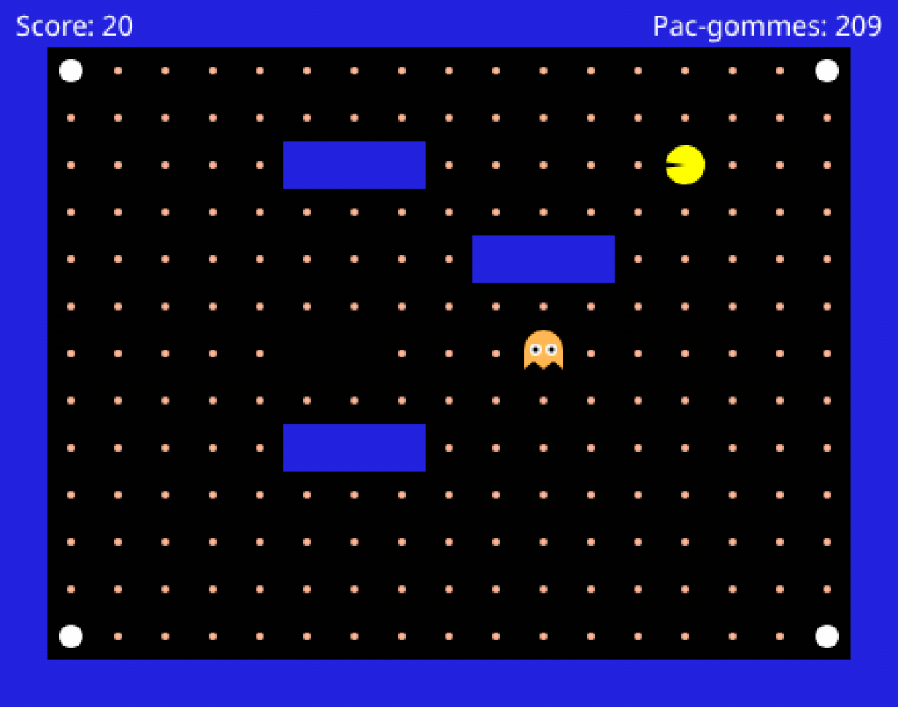

<!-- ws: {type: hint} -->
<details><summary>Si tu es bloqué</summary>

Il sort toujours de l'écran ? Tu as laissé `canGoLeft = true` quelque part, ou tu as ajouté la
nouvelle ligne sans effacer l'ancienne.

Il ne bouge plus du tout ? Vérifie le `-` de `ghost.X - 1` et la **virgule** en fin de ligne.

</details>

## Étape 3 : Savoir de quel côté est Pac-Man
<!-- ws: {type: exercise, id: a1-distance-x} -->

Ton fantôme fonce à gauche même quand tu es à droite : il lui manque de savoir de quel côté tu es. Une soustraction suffit.

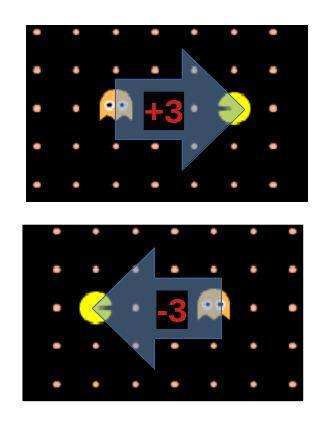

`distanceX` **positif** : Pac-Man est à **droite**. **Négatif** : à **gauche**.
Une distance est la différence entre deux positions.

### Boîte à outils

> **Outil : `and` exige que deux conditions soient vraies.**
> ```lua
> if ilFaitFroid and jaiUnManteau then
>   return 'sortir'
> end
> ```
> 📘 [Les opérateurs logiques](https://www.lua.org/manual/5.3/manual.html#3.4.5)

> Le jeu te donne déjà les outils pour avoir la position de Pac-Man : `pacman.X` et `pacman.Y`

### 🥸 Mise en application

**Ton objectif :** un fantôme qui ne va à gauche que si **tu** es à sa gauche, et qu'il peut y aller.

```lua
-- dans buildInfos
return {
  canGoLeft = not map.isWall(ghost.X - 1, ghost.Y),
  distanceX = pacman.X - ghost.X,
}
```

```lua
-- dans chooseDirection
if infos.canGoLeft and infos.distanceX < 0 then
  return 'left'
end
return nil
```

Tu dois obtenir ceci :

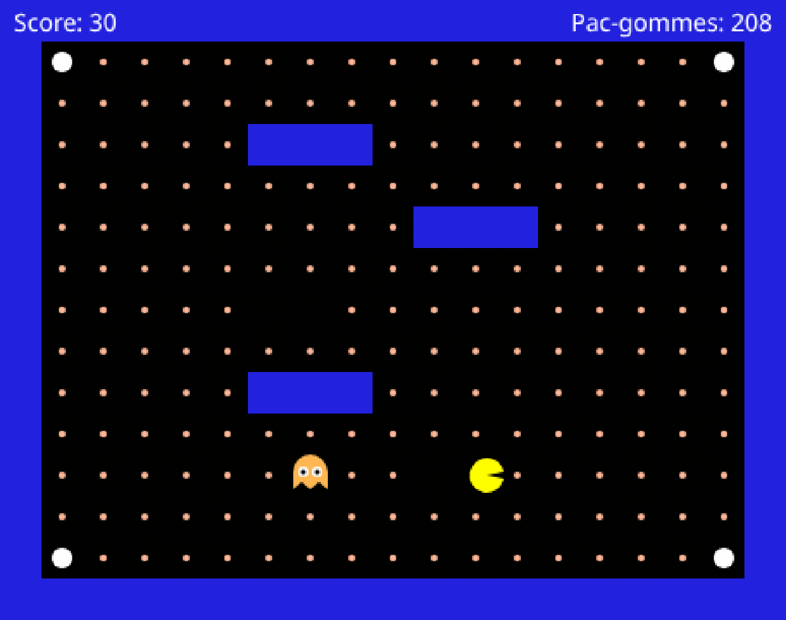

Sauf qu'un fantôme immobile, ça peut aussi vouloir dire que ton code est cassé. Pour faire la différence, **repose Pac-Man à gauche du fantôme et relance** : il doit repartir vers lui comme à
l'étape 2. Immobile à droite, en route à gauche, là tu es sûr de toi.

Pour le déplacer, attrape-le à la souris quand le jeu est **arrêté** :

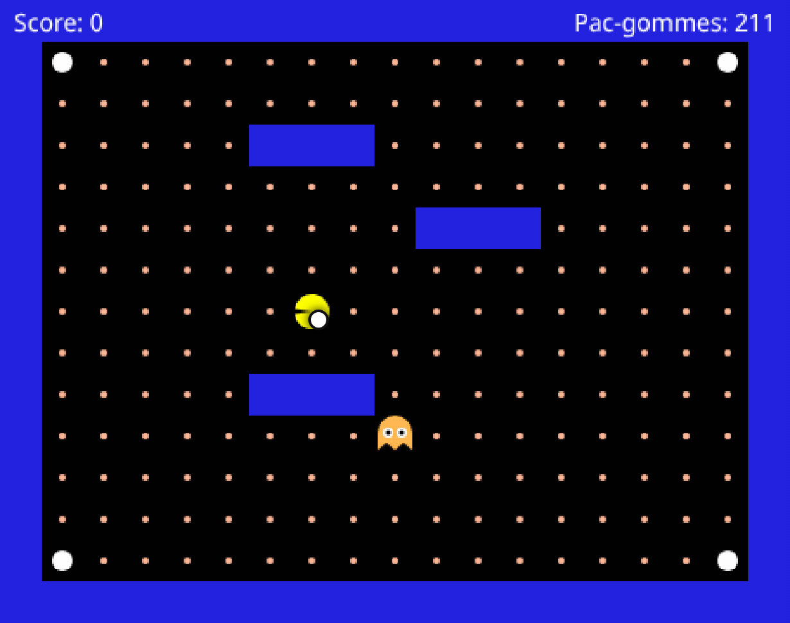

<details><summary><b>À quoi ressemble ton fichier en entier, à ce stade</b></summary>

```lua
function buildInfos(ghost, pacman, map)
  return {
    canGoLeft = not map.isWall(ghost.X - 1, ghost.Y),
    distanceX = pacman.X - ghost.X,
  }
end

function chooseDirection(infos, map)
  if infos.canGoLeft and infos.distanceX < 0 then
    return 'left'
  end
  return nil
end

function updateState(infos, game)
  return 'patrol'
end
```

</details>

<!-- ws: {type: hint} -->
<details><summary>Si tu es bloqué</summary>

Immobile **des deux côtés** ? Ce n'est pas ta règle, c'est ton code. Compare avec le fichier complet ci-dessus, ligne par ligne : la virgule après `distanceX`, et le `then` en fin de `if`.

</details>

## Étape 4 : La droite
<!-- ws: {type: exercise, id: a1-directions-completes} -->

Pour aller à droite, c'est comme pour aller à gauche... mais dans l'autre sens.

- Pour regarder ce qu'il y a gauche de ton fantôme, tu regardes `ghost.X - 1`. Pour la droite ?
- Et pour savoir si Pac-Man est à gauche, tu regardes si `infos.distanceX` est négatif. Et pour savoir s'il est à droite ?

### Boîte à outils

> **Outil : `>` « plus grand que ».**
> Sur un exemple qui n'a rien à voir, un thermomètre :
> ```lua
> if temperature > 30 then
>   return 'canicule'
> end
> ```
> 📘 [Les opérateurs de comparaison](https://www.lua.org/manual/5.3/manual.html#3.4.4)

> **Outil : empiler une deuxième règle.**
> Quand tu as plusieurs règles, elles se posent **l'une après l'autre**, chacune avec son propre
> `end`, et le `return nil` reste **tout en bas**. Sur un exemple qui n'a rien à voir, choisir
> un bus :
> ```lua
> if busRougeArrive and jeVaisAuNord then
>   return 'rouge'
> end
> if busBleuArrive and jeVaisAuSud then
>   return 'bleu'
> end
> return nil
> ```
> `return nil` reste le dernier mot de la fonction : tout ce qui est écrit après lui n'est
> jamais lu.

### 🥸 Mise en application

**Ton objectif :** un fantôme qui te suit dans les deux sens sur une ligne horizontale.

```lua
-- dans buildInfos
return {
  canGoLeft = not map.isWall(ghost.X - 1, ghost.Y),
  distanceX = pacman.X - ghost.X,
  canGoRight = nil, -- remplace nil par ton code
}
```

**Chaque ligne se termine par une virgule**, sauf la dernière si tu veux. Oublie-en une au
milieu et le programme plante.

Puis **une règle de plus** dans `chooseDirection`, avant le `return nil` final, sans supprimer
celle de gauche : « si le fantôme peut aller à droite **et** que Pac-Man est à sa droite, alors il
va à droite. »

Tu dois obtenir ceci :

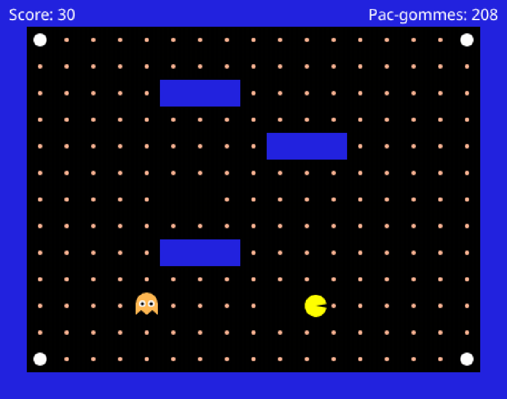

<!-- ws: {type: hint} -->
<details><summary>Si tu es bloqué</summary>

Il ne va toujours qu'à gauche ? Ta nouvelle règle est peut-être **après** le `return nil` : tout
ce qui suit un `return` n'est jamais lu.

</details>

## Étape 5 : L'axe vertical
<!-- ws: {type: exercise, id: a1-haut-bas} -->

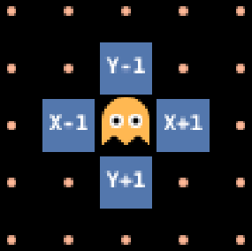

Même modèle, sur l'autre axe. Une seule différence, et c'est **le** piège de la partie : `Y`
augmente vers le **bas**. Donc `distanceY` positif veut dire que Pac-Man est **en dessous**, pas
au-dessus.

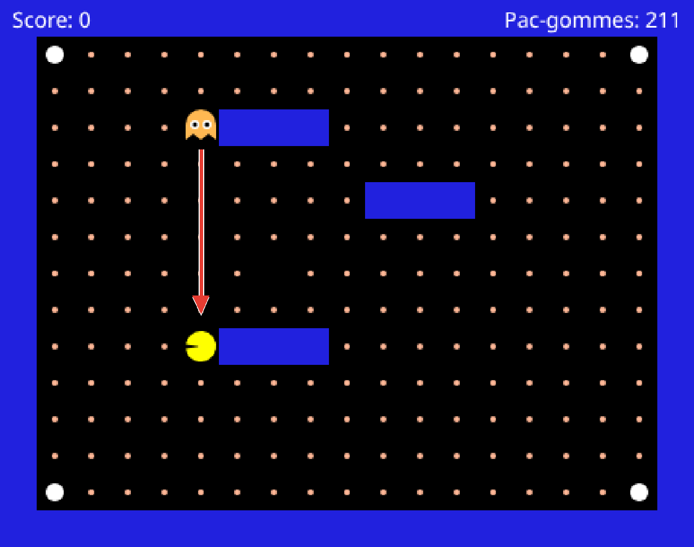

Les deux directions te manquent aussi : le fantôme réagira lorsque `chooseDirection` retournera `'up'` et `'down'` (avec les apostrophes, exactement comme `return 'left'` et `return 'right'`).

### 🥸 Mise en application

**Ton objectif :** un fantôme qui te suit partout, plus seulement sur une ligne.

```lua
-- dans buildInfos
return {
  canGoLeft = not map.isWall(ghost.X - 1, ghost.Y),
  distanceX = pacman.X - ghost.X,
  canGoRight = not map.isWall(ghost.X + 1, ghost.Y),
  canGoUp = nil,   -- remplace nil par ton code
  canGoDown = nil, -- idem
  distanceY = nil, -- idem
}
```

Puis **deux règles de plus** dans `chooseDirection`, sur le modèle des deux que tu as déjà.

Tu dois obtenir ceci :

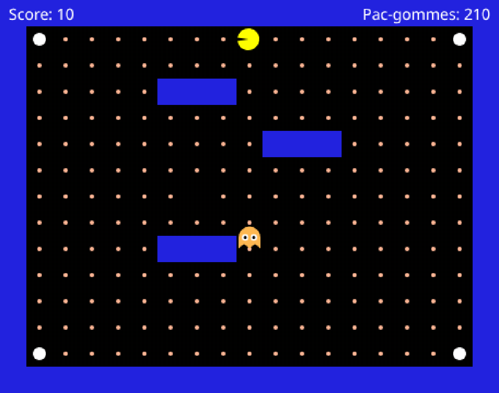

## Étape 6 : L'ordre des règles compte
<!-- ws: {type: exercise, id: a1-priorite-regles} -->

Quand Pac-Man est en diagonale, plusieurs de tes règles sont vraies en même temps. Le **premier
`if` avec une condition valide** l'emporte, et les `if` suivants ne sont même pas lus.

### 🥸 Mise en application

**Ton objectif :** faire prendre au fantôme un chemin différent, sans changer une seule de tes
règles.

**D'abord**, à la souris et jeu arrêté, mets le fantôme dans un coin et Pac-Man dans le coin
opposé, le plus loin possible. Lance, et regarde **par quel axe (horizontal ou vertical) le fantôme démarre**.

Puis, dans `chooseDirection` uniquement, échange l'ordre de tes règles horizontales et verticales.
**Ne touche à rien d'autre** : laisse le fantôme et Pac-Man exactement dans les coins où tu les as
posés. Si tu les déplaces aussi, le trajet changera, mais tu ne sauras pas si c'est à cause de
l'ordre ou à cause de tes coins. Relance, et regarde de nouveau.

Tu dois obtenir ceci : **deux trajets opposés, avec exactement les mêmes règles** :

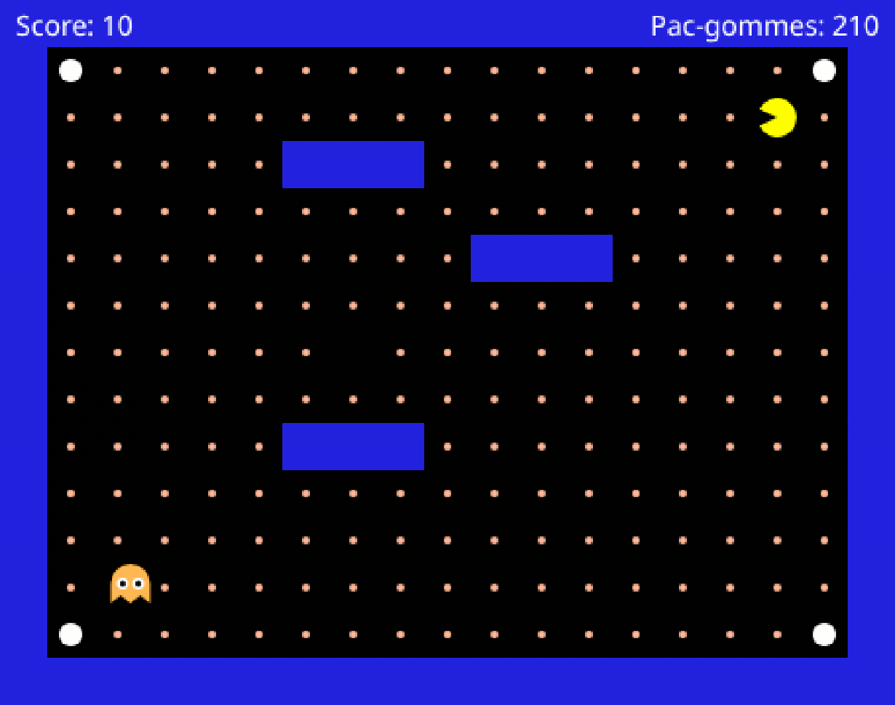

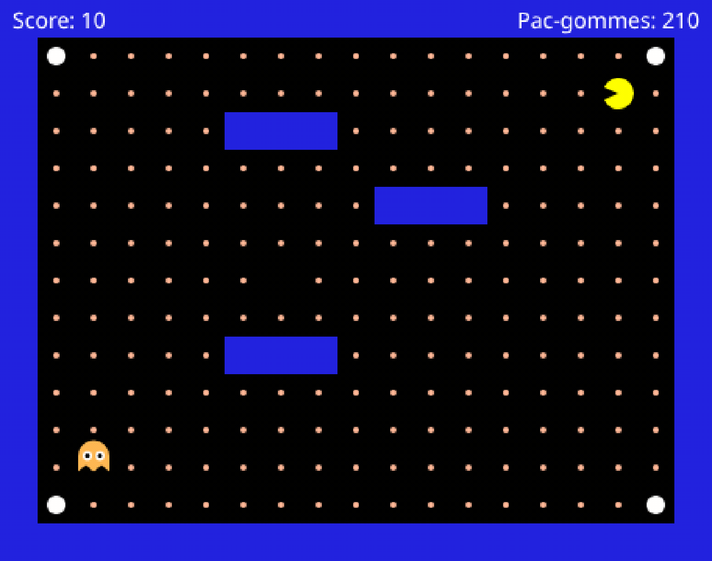

**C'est réussi quand tu as vu les deux.** Les deux trajets se ressemblent ? Déplace le fantôme
d'une ou deux cases et recommence : depuis certaines cases une seule direction est libre, et
l'ordre n'y change rien.

## Étape 7 : Couper en diagonale
<!-- ws: {type: exercise, id: a1-optimiser-recherche} -->

Jusqu'ici tes règles sont testées dans un ordre fixé d'avance. Teste d'abord l'axe où l'écart est
**le plus grand**.

Le fantôme avance alors d'une case sur cet axe, l'écart y diminue, l'autre axe devient le plus
grand, et il change de sens à la case suivante. C'est ce va-et-vient qui dessine l'escalier.

C'est l'étape la plus lourde de la partie : prends ton temps.

### Boîte à outils

> **Outil #1 : `math.abs` retire le signe.**
> ```lua
> print(math.abs(5))    -- 5
> print(math.abs(-5))   -- 5
> ```
> Ici tu compares deux écarts : `-7` n'est pas « plus petit » que `2`, c'est 7 cases contre 2.
> Sans `math.abs`, ta comparaison répondrait le contraire de la vérité.
> 📘 [`math.abs`](https://www.lua.org/manual/5.3/manual.html#pdf-math.abs)

> **Outil #2 : `else`, le chemin d'à côté.**
> `else` dit quoi faire quand la condition est fausse. Un seul des deux blocs s'exécute, jamais
> les deux.
> ```lua
> if temperature > 25 then
>   print('on sort les glaces')
> else
>   print('on sort les parapluies')
> end
> print('dans tous les cas, on ouvre la boutique')
> ```
> Deux choses à noter : `else` **ne prend pas** de `then`, et il n'y a **qu'un seul `end`**
> pour les deux blocs.
> 📘 [`if / else / end`](https://www.lua.org/manual/5.3/manual.html#3.3.4)

> **Outil #3 : des règles *dans* un `else`.**
> Chaque branche d'un `if / else` peut contenir des règles entières, avec leurs propres `end`.
> Loin du fantôme, juste pour voir la forme. Servir une table selon qu'il reste du plat du jour :
> ```lua
> if resteDuPlat then
>   if clientPressé then
>     return 'plat du jour'
>   end
>   if clientVégétarien then
>     return 'légumes'
>   end
> else
>   if clientPressé then
>     return 'sandwich'
>   end
>   if clientVégétarien then
>     return 'salade'
>   end
> end
> return nil
> ```
> **Compte les `end` de cet exemple : il y en a cinq.** Un par règle intérieure, il y en a
> quatre, **plus un** pour le `if / else` qui les contient, tout en bas. Et un `return`
> intérieur sort de la fonction entière, pas seulement de sa branche.

### 🥸 Mise en application

**Ton objectif :** un fantôme qui coupe en diagonale au lieu de faire un grand trait puis un
virage. Sur une cible qui ne bouge pas, ça ne change rien : même nombre de cases. Sauf que toi,
tu bouges.

Oui, huit règles qui se ressemblent, c'est lourd. Mais c'est pratiquement toujours la même
chose, avec un petit bout à changer à chaque fois.

Réorganise `chooseDirection` sur cette ossature. Le `end` de l'ossature est déjà placé, tes
règles, elles, gardent chacune le sien.

```lua
if nil then -- remplace nil par ta comparaison
  -- tes 4 règles, gauche / droite d'abord
else
  -- tes 4 règles, haut / bas d'abord
end
return nil
```

Tu dois obtenir ceci :

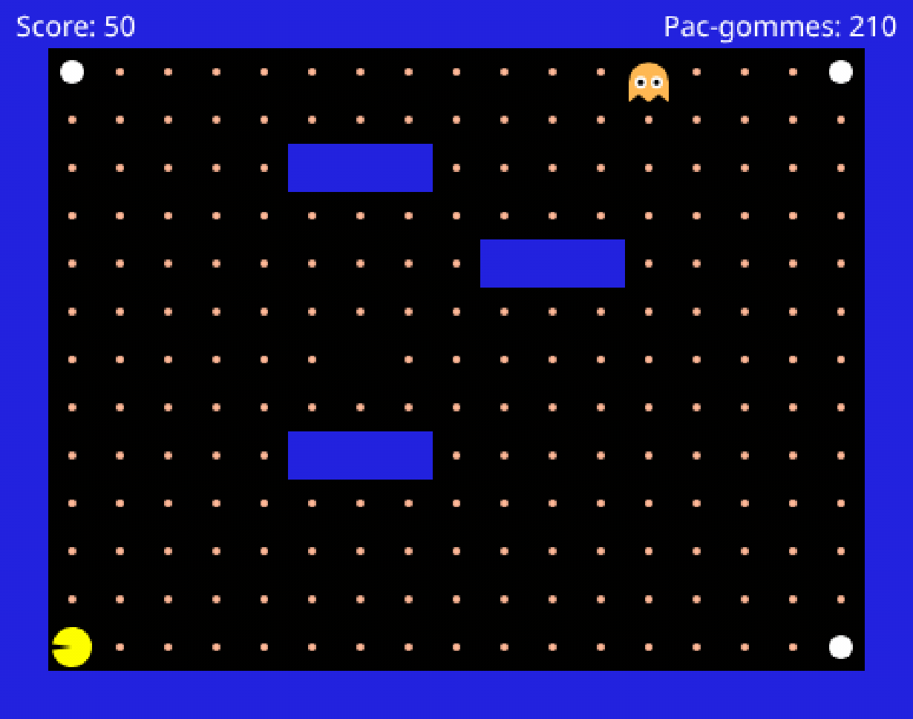

<!-- ws: {type: hint} -->
<details><summary>Si tu es bloqué</summary>

**Coupe l'étape en deux, teste au milieu.**

*Moitié 1, la comparaison seule.* `print(math.abs(infos.distanceX), math.abs(infos.distanceY))` au
début de `chooseDirection`. Les deux nombres s'affichent dans le panneau **Console**, sous
l'éditeur. Ça défile : regarde la dernière ligne. Bougent-ils comme tu l'attends quand tu te
déplaces ?

*Moitié 2, la structure.* Tes règles marchent déjà : tu n'as **rien** à réécrire dedans. Tu les
recopies dans les deux branches, dans un ordre différent.

</details>

## Étape 8 : Jouer une partie complète
<!-- ws: {type: exercise, id: a1-partie-complete} -->

- **Victoire** : **toutes** les pac-gommes, y compris celle cachée sous le fantôme au départ.
- **Mort** : tu le touches → « **Perdu !** », et ça redémarre après 3 s.
- Les grosses pac-gommes blanches ne font rien pour l'instant.

Profite de ce que tu as fait.

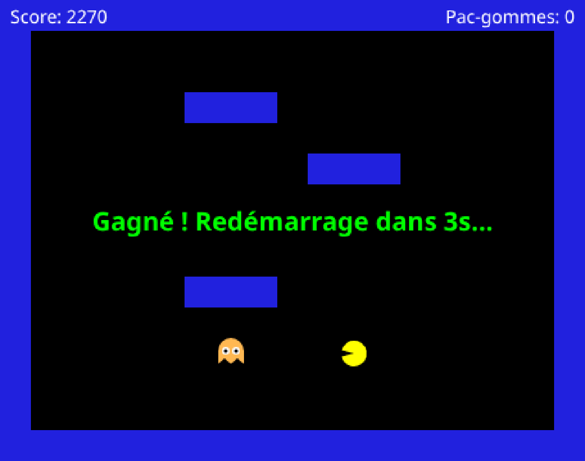

> **Tu n'as pas encore gagné de partie ?** Ce n'est pas grave. Un fantôme qui te poursuit, même
> imparfaitement, c'est déjà ton code qui décide.

<!-- ws: {type: hint} -->
<details><summary>Si tu es bloqué</summary>

Tu perds tout le temps ? Sers-toi des trois pavés bleus : ton fantôme ne sait pas contourner,
un mur entre vous et il vient s'y coller.

Un bug revient ? Fais afficher tes variables avec `print` : le texte sort dans le panneau
**Console**, sous l'éditeur. Commence par la ligne que tu viens d'écrire.

</details>

## Défis bonus
<!-- ws: {type: exercise, id: a1-bonus, optional: true} -->

Quatre pistes, sans correction. Les trois premières n'utilisent que ce que tu as déjà ; la
dernière ajoute une notion. Aucune ne bloque la suite.

1. **Le fantôme prudent.** Fais-le s'arrêter net à moins de 2 cases, au lieu de foncer dedans.
   *C'est réussi si :* il se fige juste à côté de toi au lieu de te toucher.
2. **Le fantôme à contresens.** À l'étape 7 tu testes d'abord l'axe le plus **long**. Inverse :
   teste d'abord le plus **court**.
   *C'est réussi si :* il colle à un axe jusqu'au bout au lieu de couper, et qu'en bougeant tu le
   sèmes plus facilement qu'à l'étape 7.
3. **Le gardien.** Quand tu es sur la même ligne **ou** la même colonne que lui, fais-le s'arrêter
   pour te barrer la route au lieu d'avancer. Deux outils de plus : `==` teste l'égalité
   (`if infos.distanceY == 0 then` = « l'écart vertical vaut exactement zéro »), et `or` remplace
   `and` quand **une seule** des deux conditions suffit.
   *C'est réussi si :* dès que tu te places sur sa ligne, il cesse d'avancer.
4. **La règle écrite une seule fois.** À l'étape 7 tu as recopié tes quatre règles dans les deux
   branches. Une **fonction** te permet de l'écrire une fois et de t'en servir partout. C'est le
   seul défi de cette page qui demande une notion neuve. La voici, sur un exemple qui n'a rien à
   voir :

   ```lua
   function ilFaitBeau(soleil, vent)
     if soleil and vent < 20 then
       return true
     end
     return false
   end

   -- ailleurs dans le fichier, autant de fois que tu veux :
   if ilFaitBeau(true, 5) then return 'parasol' end
   ```

   Les noms entre parenthèses de la **première** ligne sont les tiens, tu les choisis ; ceux de
   l'appel sont les vraies valeurs. Écris ta fonction **en dehors** des trois autres, jamais
   dedans : le jeu lit ton fichier en entier et n'appelle que les trois qu'il connaît.
   *C'est réussi si :* ton `chooseDirection` est plus court qu'avant, et que ton fantôme se
   comporte exactement comme à l'étape 7.

Et deux questions sans réponse écrite, pour celles et ceux que ça amuse : ce fantôme est-il
vraiment *intelligent* ? Et trouves-tu une position de départ où il se coince derrière un mur
alors qu'un détour l'aurait ramené sur toi ?

## Fin de la partie 1

Ton fantôme poursuit Pac-Man, et c'est **ton** ordre de règles qui lui donne sa façon de chasser.

Des arbres de décision, tu en croises tous les jours : **on te pose des questions dans un ordre,
et cet ordre change où tu arrives.** Un formulaire qui change selon tes réponses, les filtres
d'un site quand tu cherches des baskets, quelqu'un a choisi l'ordre des questions. Comme toi à
l'étape 6.

> **Si tu enchaînes sur la partie 2**, ton fantôme y gagnera trois humeurs, et la grosse
> pac-gomme blanche servira enfin à quelque chose.
