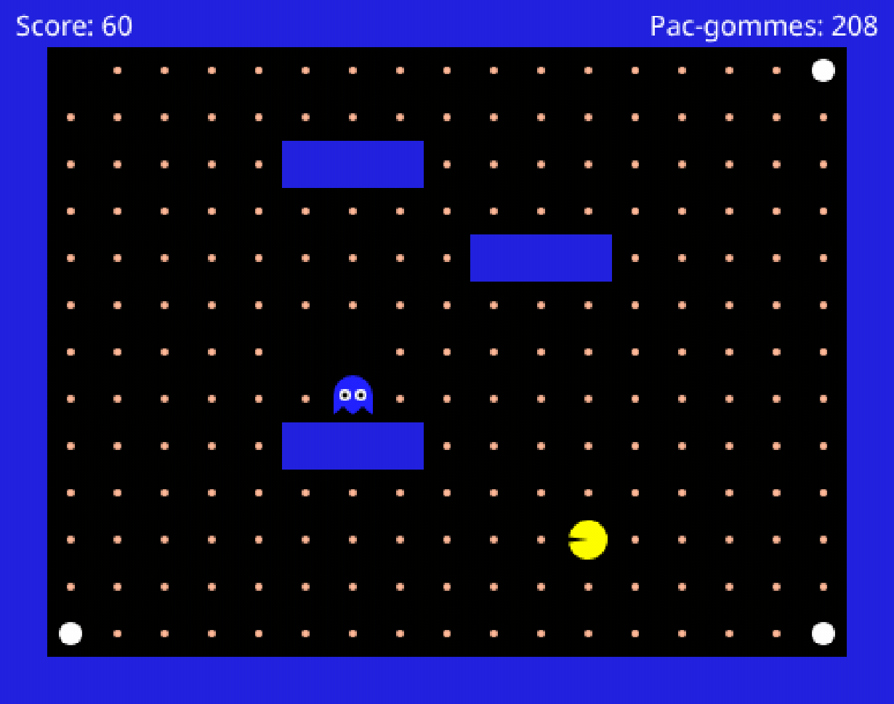
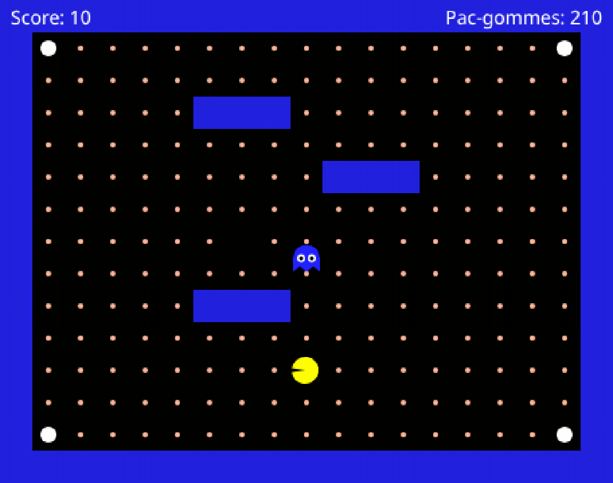

# Partie 2 : Machine à états finis

Ton fantôme poursuit **tout le temps**, même à l'autre bout de la carte : impossible de le semer
une seconde. Tu vas lui donner trois humeurs.

| `patrol` | `follow` | `scared` |
| --- | --- | --- |
|  |  |  |
| Tu es loin : il erre au hasard. | Tu es proche : il utilise ton arbre de la partie 1. | Tu as mangé une super pac-gomme : il fuit. |

**La couleur du fantôme te dit dans quel mode il est.** C'est comme ça que tu vérifieras ton code
à chaque étape.

**Ce qu'il te faut :** un fantôme qui bouge, où que tu te sois arrêté dans la partie 1.
La partie 2 enveloppe ton arbre **tel qu'il est** : même un fantôme qui ne sait aller qu'à gauche
prendra les trois couleurs.

> 🛟 **Coincé ?** Les termes propres à cette partie sont dans le glossaire juste en dessous.

<details><summary><b>Glossaire de la partie 2</b></summary>

| Terme | Signification |
| --- | --- |
| `updateState` | Fonction qui choisit le mode : `patrol`, `follow` ou `scared` |
| `'patrol'` | Le fantôme erre au hasard (orange) |
| `'follow'` | Le fantôme utilise l'arbre de décision de la partie 1 (rouge) |
| `'scared'` | Le fantôme fuit (bleu) |
| `super pac-gomme` | Grande pac-gomme blanche dans les 4 coins, effraie le fantôme 8 secondes |
| `game.scaredTimer` | Temps restant de la super pac-gomme (> 0 = peur active) |
| `state` | Mode actuel, tu le recopies : `state = ghost.state` |
| `currentDirection` | Dernière direction, tu la recopies : `currentDirection = ghost.direction` |
| `patrolDirectionTimer` | Compte à rebours géré par le jeu, tu le recopies : `patrolDirectionTimer = ghost.patrolDirectionTimer` |
| `totalDistance` | Tu le calcules : le nombre de cases entre le fantôme et Pac-Man |

</details>

## Étape 1 : L'état du fantôme
<!-- ws: {type: exercise, id: a2-etat-patrol} -->

Une **machine à états finis** est dans une seule humeur à la fois, et elle en change quand un
événement arrive.


Ce diagramme est le plan de toute la partie : `updateState` écrit les **flèches**, celles qui font
passer d'un mode à l'autre. `chooseDirection`, lui, décide comment bouger **une fois dans un
mode**. Pour qu'il puisse lire le mode, il faut d'abord le faire passer par `infos`.

### 🥸 Mise en application

**Ton objectif :** brancher le fil. Rien ne changera à l'écran, c'est normal.

```lua
-- dans buildInfos, une propriété de plus
state = ghost.state,
```

```lua
-- dans updateState, laisse
return 'patrol'
```

Tu dois obtenir ceci : il poursuit comme avant, et il est **orange**, la couleur de la patrouille.


## Étape 2 : Patrouiller
<!-- ws: {type: exercise, id: a2-patrouiller} -->

En `'patrol'`, le fantôme erre : il choisit au hasard, sans te chercher. Mais au hasard **à chaque
case**, il tremblerait sur place, il garde donc sa direction un moment.

Ce moment, c'est le jeu qui le compte en secondes, dans `patrolDirectionTimer`. Toi, tu le lis.

Il descend tant que le fantôme continue tout droit. Quand il arrive à **0**, c'est le signal :
tu tires une nouvelle direction, et le jeu remet le compteur à 1,5 s tout seul.

Compte trois quarts d'heure : c'est le gros morceau de la partie. Les deux règles de la patrouille :

1. `infos.patrolDirectionTimer > 0` **et** la case devant est libre → continue dans `infos.currentDirection`
2. sinon → tire une direction **au hasard** parmi les directions libres

### Boîte à outils

> **Outil #1 : `==` demande « est-ce exactement ça ? »**
> Un seul `=` range une valeur ; deux `==` posent une question.
> ```lua
> if dessert == 'glace' then
>   print('parfait')
> end
> ```
> 📘 [Les opérateurs relationnels](https://www.lua.org/manual/5.3/manual.html#3.4.4)

> **Outil #2 : construire une liste petit à petit.**
> `{}` crée une liste vide, `table.insert` y ajoute un élément à la fin.
> ```lua
> desserts = {}
> if glaceDispo then table.insert(desserts, 'glace') end
> if gateauDispo then table.insert(desserts, 'gâteau') end
> ```
> 📘 [`table.insert`](https://www.lua.org/manual/5.3/manual.html#pdf-table.insert)

> **Outil #3 : aller d'un mot à la bonne réponse.**
> Tu as un mot d'un côté (`'left'`), et des réponses aux noms différents de l'autre
> (`canGoLeft`...). Le plus direct est de poser la question cas par cas :
> ```lua
> if animal == 'chien' then return leChienAboie end
> if animal == 'chat'  then return leChatMiaule end
> ```
> *(Il existe plus court, si tu ranges tes réponses autrement. Cherche, si ça t'amuse.)*
> 📘 [Les opérateurs relationnels](https://www.lua.org/manual/5.3/manual.html#3.4.4)

> **Outil #4 : tirer au hasard dans une liste.**
> `#liste` donne le nombre d'éléments, `math.random(1, n)` tire un entier entre 1 et n inclus.
> ```lua
> index = math.random(1, #desserts)
> return desserts[index]
> ```
> **En Lua, les listes commencent à 1**, pas à 0. Et si la liste est vide (`#desserts == 0`), ne
> fais pas ce calcul.
> 📘 [`math.random`](https://www.lua.org/manual/5.3/manual.html#pdf-math.random) ·
> [l'opérateur `#`](https://www.lua.org/manual/5.3/manual.html#3.4.7)

### 🥸 Mise en application

**Ton objectif :** un fantôme qui erre sans te chercher, en tenant sa direction environ une
seconde et demie.

Ajoute `currentDirection = ghost.direction` et `patrolDirectionTimer = ghost.patrolDirectionTimer` dans
`buildInfos`, puis un bloc `if infos.state == 'patrol' then` **au début** de `chooseDirection`,
avant tes règles de poursuite, qui applique les deux règles ci-dessus.

`ghost.direction` vaut `'left'`, `'right'`, `'up'`, `'down'` ou `nil` au premier tour.

Tu dois obtenir ceci : il erre sans traverser un seul mur, et il ne te poursuit plus du tout,
même collé à toi. C'est voulu et c'est
temporaire : la poursuite revient à l'étape 3, en mieux.


<!-- ws: {type: hint} -->
<details><summary>Si tu es bloqué</summary>

**Coupe l'étape en deux, teste au milieu.**

*Moitié 1, le hasard seul.* Oublie le timer : construis la liste des directions libres, tire
dedans, renvoie. Voilà à quoi ça doit ressembler, c'est laid, et c'est exactement ce qu'on veut
voir à ce stade :


*Moitié 2, le timer.* Ajoute devant une règle qui renvoie `currentDirection` quand
`patrolDirectionTimer > 0` et que la case devant est libre.

**Ta liste se construit-elle ?** `print(#directionsLibres)` juste avant le tirage, et regarde le
panneau **Console**, sous l'éditeur. Si le nombre reste à 0, le problème est dans tes `if`, pas
dans le tirage.

**« La case devant est libre »** : tu as déjà les quatre réponses dans `infos` depuis la partie 1.
À toi de choisir la bonne selon `currentDirection`.

**Il te poursuit encore, comme avant ?** Alors ton bloc `patrol` n'est jamais atteint : remonte
à l'étape 1 et vérifie que `state = ghost.state,` est bien dans `buildInfos`. Sans cette ligne,
`infos.state` ne vaut rien et ton test échoue en silence.

Le fantôme se fige d'un coup ? `currentDirection` vaut `nil` au premier tour, et `nil` n'est pas
une direction valide.

</details>

## Étape 3 : Poursuivre seulement quand tu es proche
<!-- ws: {type: exercise, id: a2-mode-follow} -->

Tu tiens les deux comportements. Maintenant, lequel s'applique quand : proche → `'follow'`, loin →
`'patrol'`.

« Proche » se mesure en **cases** : l'écart horizontal **plus** l'écart vertical. Pas la distance
à vol d'oiseau. Le seuil de cette partie est **5 cases**.

### Boîte à outils

> **Outil : `math.abs` retire le signe.**
> ```lua
> print(math.abs(5))    -- 5
> print(math.abs(-5))   -- 5
> ```
> Que Pac-Man soit trois cases à gauche ou trois cases à droite, il est à trois cases.
> 📘 [`math.abs`](https://www.lua.org/manual/5.3/manual.html#pdf-math.abs)
>
> *(Si tu as fait l'étape 7 de la partie 1, tu le connais déjà.)*

> **Outil : `<=` « plus petit ou égal ».**
> `a < b` est faux quand `a` vaut exactement `b`. `a <= b` est vrai dans ce cas.
> ```lua
> if age <= 17 then
>   return 'tarif jeune'
> end
> ```
> 📘 [Les opérateurs de comparaison](https://www.lua.org/manual/5.3/manual.html#3.4.4)

### 🥸 Mise en application

**Ton objectif :** un fantôme qui te lâche quand tu t'éloignes, et te repère quand tu reviens.

1. `buildInfos` : une propriété `totalDistance` qui vaut la distance en cases
2. `updateState` : `'follow'` si elle vaut 5 cases ou moins, sinon `'patrol'`
3. `chooseDirection` : enveloppe tout ton arbre de la partie 1 dans un test sur `infos.state` :

```lua
if infos.state == 'patrol' then
  -- ta patrouille (étape 2)
else
  -- tout ton arbre de la partie 1, tel quel
end
```

Tu dois obtenir ceci : **orange** de loin, **rouge** à 5 cases ou moins, orange à nouveau quand tu
t'éloignes.


<!-- ws: {type: hint} -->
<details><summary>Si tu es bloqué</summary>

Orange en permanence ? `print(infos.totalDistance)` au début de `chooseDirection`, et regarde le
panneau **Console** : en te rapprochant, le nombre doit descendre vers 0 en restant **positif**.
S'il devient négatif, il te manque la valeur absolue.

Rouge en permanence ? Dans `updateState`, as-tu vraiment un cas qui renvoie `'patrol'` ?

Rouge mais immobile ? Ton arbre de la partie 1 est resté **en dehors** du test sur `infos.state`,
ou le `return nil` final est passé à l'intérieur.

</details>

## Étape 4 : La super pac-gomme
<!-- ws: {type: exercise, id: a2-super-pac-gomme} -->

Les quatre grosses pac-gommes blanches, dans les coins, sont des **super pac-gommes**. Quand tu en
manges une, `game.scaredTimer` passe à 8 et redescend seconde après seconde. Au-dessus de 0, le
fantôme a peur.

Ce mode passe **avant** les deux autres : proche ou loin, un fantôme terrifié reste terrifié.

### Boîte à outils

> **Outil : l'ordre des tests dans une cascade.**
> Autre décor, même mécanique. Décider quoi mettre sur soi :
> ```lua
> if ilNeige then return 'doudoune' end
> if ilPleut then return 'imperméable' end
> return 'tee-shirt'
> ```
> Le premier `return` atteint arrête tout : mets en haut le cas qui doit gagner même quand les
> autres sont vrais aussi.

### 🥸 Mise en application

**Ton objectif :** un fantôme qui devient bleu quand tu manges une grosse pac-gomme blanche, et
que tu peux alors traverser sans mourir.

Dans `updateState` seulement, teste les trois modes dans l'ordre `scared`, `follow`, `patrol`. Ne
touche pas à `chooseDirection`.

Tu dois obtenir ceci. Il reste bleu 8 secondes, puis redevient orange ou rouge selon où tu es :



Il continue à patrouiller ou à te poursuivre, c'est normal : `chooseDirection` ne connaît pas
encore ce mode.

<!-- ws: {type: hint} -->
<details><summary>Si tu es bloqué</summary>

Jamais bleu ? Les petites pac-gommes orange ne comptent pas : il faut les **grosses blanches**,
dans les quatre coins.

Toujours pas ? `print(game.scaredTimer)` au début de `updateState`, et regarde le panneau
**Console**. Si le nombre saute à 8 quand tu en manges une, le problème est dans ton `if`, pas
dans le jeu.

Bleu seulement quand tu es loin ? Ton test `scared` est passé **après** le test `follow`.

</details>

## Étape 5 : Fuir
<!-- ws: {type: exercise, id: a2-fuir-scared} -->

En `'scared'`, le fantôme **fuit**. Là où ton arbre disait « Pac-Man est à gauche, va à gauche »,
la fuite dit l'inverse.

### 🥸 Mise en application

**Ton objectif :** un fantôme bleu qui s'écarte au lieu de te courir après, et qui reste dans les
couloirs.

Ajoute un bloc `scared` à côté des deux autres : trois blocs côte à côte, chacun avec son propre
`return`. N'oublie pas les
`canGo...` : un fantôme paniqué ne traverse pas les murs pour autant.

Tu dois obtenir ceci :



<!-- ws: {type: hint} -->
<details><summary>Si tu es bloqué</summary>

Il ne fuit que dans une direction ? Tu as inversé la comparaison d'un axe et oublié l'autre.
Reprends tes quatre règles une par une : chacune a exactement une comparaison à retourner.

Il ne bouge plus du tout en bleu ? Il est peut-être acculé : toutes les directions libres le
rapprochent de toi, donc aucune de tes règles ne s'applique :


Que **devrait** faire ton code dans ce cas ? Il n'y a pas une seule bonne réponse, et c'est toi
qui décides : rester immobile et se faire manger, prendre quand même la case la moins mauvaise, ou
repartir en patrouille. Les trois se défendent. Choisis, écris-le, regarde ce que ça donne.

</details>

## Étape 6 : Le fantôme complet
<!-- ws: {type: exercise, id: a2-fantome-complet} -->

Tes trois modes existent séparément. Reste à voir s'ils s'enchaînent proprement.

### 🥸 Mise en application

**Ton objectif :** retrouver les six comportements ci-dessous. Pas besoin de finir la partie, tu
provoques chaque situation exprès, en deux minutes.

| Ce que tu fais | Ce que tu dois voir |
| --- | --- |
| Tu restes à l'autre bout de la carte | **orange**, il erre, virages toutes les ~1,5 s |
| Tu approches à 5 cases ou moins | **rouge**, il fonce sur toi |
| Tu manges une grosse pac-gomme blanche | **bleu**, il s'écarte pendant 8 s |
| Tu le touches en bleu | rien, tu passes au travers |
| Tu le touches en orange ou rouge | tu meurs, ça redémarre après 3 s |
| À tout moment | il ne traverse aucun mur |

Et si tu veux la gagner en entier, 211 pac-gommes et un score de **2 270**, c'est bien plus dur avec ce
fantôme-là qu'à la partie 1 :


> **Tu n'as pas fini les étapes précédentes ?** Va quand même voir le bonus **Ton fantôme à toi** :
> deux modes qui s'enchaînent se règlent aussi bien que trois.

<!-- ws: {type: hint} -->
<details><summary>Si tu es bloqué</summary>

Un mode ne se déclenche jamais ? Reviens à l'étape qui l'a introduit et refais sa **Mise en
application** toute seule. Commence par le mode que tu viens d'ajouter.

</details>

## Ton fantôme à toi
<!-- ws: {type: exercise, id: a2-ton-fantome, optional: true} -->

*Tu es arrivé au bout, les trois modes s'enchaînent. Ce qui suit n'est plus un exercice : c'est
ta récompense, et c'est la partie que personne ne fait pareil.*

Ton fantôme marche, mais ses réglages sont ceux qu'on t'a donnés. Son caractère tient dans ces
trois lignes du tableau : deux nombres et un ordre :

| Ce que tu changes | Ce que ça donne |
| --- | --- |
| le seuil des 5 cases | un fantôme myope, ou un qui te repère de l'autre bout de la carte |
| l'ordre des règles dans `follow` | un qui te coupe la route, ou un qui te colle au train |
| le seuil auquel tu compares `patrolDirectionTimer` | `> 0` le laisse tenir sa direction 1,5 s ; `> 0.75` le fait tourner deux fois plus souvent (un nombre s'écrit avec un **point** en Lua) |

Un seul de ces nombres suffit à changer son caractère. Même trajet de Pac-Man, deux fantômes opposés :


### 🥸 Mise en application

**Ton objectif :** un fantôme qui te ressemble, et une partie jouée contre lui.

1. Écris son caractère en trois phrases, **en français**. Par exemple : *« Il ne me voit que de
   très près. Mais dès qu'il me voit, il coupe au plus court. Et il ne lâche plus. »*
2. Traduis chaque phrase en un réglage, et donne-lui un nom.
3. Lance, joue trente secondes : ta description se vérifie-t-elle à l'écran ?

Puis joue contre lui.

> **Ton score de survie.** Joue jusqu'à ce qu'il t'attrape : le **Score** affiché quand
> « Perdu ! » apparaît, c'est ce que tu as ramassé avant qu'il te tombe dessus. Plus il est bas,
> plus ton fantôme t'a mené la vie dure.

Note-le, change **un** réglage, rejoue. Trois fois.

| Essai | Ce que j'ai changé | Mon score de survie |
| --- | --- | --- |
| 1 | (les réglages de la partie) | |
| 2 | | |
| 3 | | |

C'est réussi quand tu sais dire **lequel des trois réglages** a rendu ton fantôme plus dur.

<!-- ws: {type: hint} -->
<details><summary>Si tu es bloqué</summary>

Tu ne vois pas quoi changer ? Prends le seuil, et uniquement lui. Mets-le à `2`, joue trente
secondes. Mets-le à `30`, rejoue.

Ton fantôme ne ressemble pas à ta description ? Change **un** réglage à la fois et relance entre
chaque. À deux changements d'un coup, on ne sait plus lequel a fait quoi.

</details>

## Défis bonus
<!-- ws: {type: exercise, id: a2-bonus, optional: true} -->

Quatre variantes de ta machine à états. Aucune correction, et rien de neuf à apprendre.

1. **L'opportuniste.** Dans `updateState`, ne le laisse pas avoir peur jusqu'au bout : dès que
   `game.scaredTimer` descend sous 2, remets-le en chasse sans attendre la fin des 8 secondes.
   *C'est réussi si :* il repasse au rouge **avant** que la super pac-gomme soit épuisée.
2. **Le fantôme rancunier.** En `scared`, ne fuis que si tu es proche : au-delà de 10 cases, il
   n'a plus peur de toi et repart en patrouille, même bleu.
   *C'est réussi si :* colle-toi à lui, il s'écarte ; éloigne-toi de dix cases, il se remet à
   errer au hasard sans t'éviter.
3. **Le fantôme imprévisible.** Combine les deux modes : en `patrol`, fais-le foncer sur toi une
   fois de temps en temps, au hasard, même si tu es loin.
   *C'est réussi si :* il t'arrive de le voir charger depuis l'autre bout de la carte.
4. **Le fantôme de 1980.** Dans le vrai Pac-Man, les fantômes ne regardaient pas la distance : ils
   alternaient au chronomètre. Au premier niveau, 7 secondes chacun dans son coin, puis 20 de
   chasse, et à chaque cycle les replis raccourcissent, jusqu'à ne plus revenir du tout. Fais
   pareil : oublie le seuil des 5 cases,
   compte tes décisions dans une variable à toi. Elle doit être créée **en dehors** des trois
   fonctions : à l'intérieur, elle serait remise à zéro à chaque appel. Puis bascule
   `patrol` / `follow` quand le compte est atteint. Vise le même rapport qu'en 1980 : une courte pause pour une longue chasse.
   *C'est réussi si :* il te lâche et te reprend tout seul, alors que tu n'as pas bougé.

## Fin de la partie 2

Ton fantôme sait patrouiller, poursuivre et prendre peur. Trois humeurs, trois couleurs, et c'est
toi qui as écrit les règles de chacune.

Tu as utilisé deux façons de programmer un comportement : un arbre de décision, puis une **machine
à états**. Ce qui sépare les deux tient dans `state` et `patrolDirectionTimer` : ton fantôme se
souvient de ce qu'il est en train de faire, et c'est ce souvenir qui décide de la suite.
