# Partie 2 : Machine à états finis

## Mise en contexte

Ton fantôme poursuit **tout le temps**, même à l'autre bout de la carte : impossible de le semer
une seconde. Tu vas lui donner trois humeurs.

| `patrol` | `follow` | `scared` |
| --- | --- | --- |
| 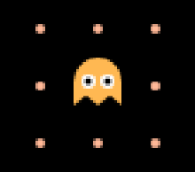 | 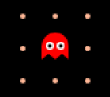 | 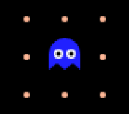 |
| Tu es loin : il erre au hasard. | Tu es proche : il utilise ton arbre de la partie 1. | Tu as mangé une super pac-gomme : il fuit. |

**La couleur du fantôme te dit dans quel mode il est.** C'est comme ça que tu vérifieras ton code
à chaque étape.

**Ce qu'il te faut :** un fantôme qui bouge, où que tu te sois arrêté dans la partie 1.
La partie 2 enveloppe ton arbre **tel qu'il est** : même un fantôme qui ne sait aller qu'à gauche
prendra les trois couleurs.

> 🛟 **Coincé ?** Les termes propres à cette partie sont dans le glossaire juste en dessous.

<details><summary>Glossaire de la partie 2</summary>

| Terme | Signification |
| --- | --- |
| `state` | La variable où tu ranges le mode : `'patrol'`, `'follow'` ou `'scared'`. Le jeu la lit après chaque appel de `ghost` et colore le fantôme |
| `'patrol'` | Le fantôme erre au hasard (orange) |
| `'follow'` | Le fantôme utilise l'arbre de décision de la partie 1 (rouge) |
| `'scared'` | Le fantôme fuit (bleu) |
| super pac-gomme | Grande pac-gomme blanche dans les 4 coins, effraie le fantôme 8 secondes |
| `game.scaredTimer` | Temps restant de la super pac-gomme (supérieur à 0 = peur active) |
| `totalDistance` | Tu le calcules : le nombre de cases entre le fantôme et Pac-Man |
| `me.direction` | La direction que le fantôme suit en ce moment, `nil` s'il est arrêté. Sert au bonus **Tenir sa direction** |
| `compteur` | Une variable à toi qui compte les cases depuis le dernier virage. Sert au bonus **Tenir sa direction** |

</details>

## Étape 0 : L'état du fantôme
<!-- ws: {type: exercise, id: a2-etat-patrol} -->

Une **machine à états finis** est dans une seule humeur à la fois, et elle en change quand un événement arrive.

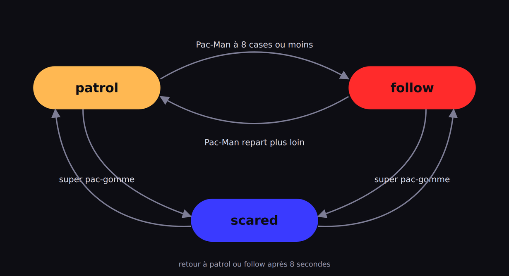

Ce diagramme est le plan de toute la partie. Le mode est une variable, `state`, que tu crées **en haut de ton fichier, en dehors de `ghost`**. Les **flèches** sont les règles qui changent `state` ; le reste de `ghost` décide comment bouger **une fois dans un mode**.

### 🥸 Mise en application

**Ton objectif :** créer la variable `state`, et vérifier que le jeu la lit.

```lua
-- tout en haut du fichier, avant function ghost()
state = 'patrol'
```

C'est son humeur de **départ** : tant que tu n'as pas écrit de flèche, il gardera celle-là toute la partie.

Pour vérifier, remplace `'patrol'` par `'follow'` et relance : le fantôme devient **rouge**. Remets `'patrol'` : il redevient orange. Le jeu lit ta variable après chaque appel de `ghost`, c'est elle qui donne sa couleur.

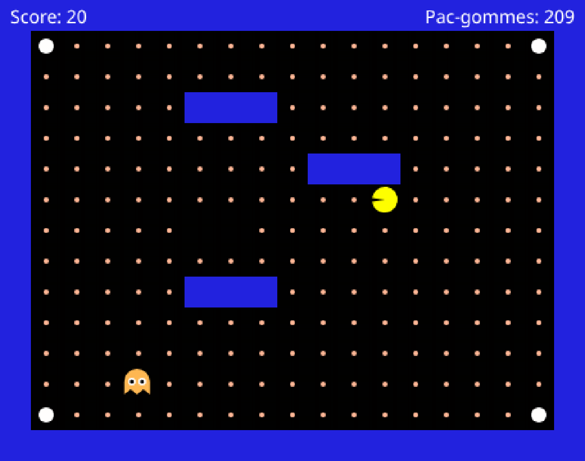

## Étape 1 : Prendre peur et fuir
<!-- ws: {type: exercise, id: a2-peur-fuite} -->

Les quatre grosses pac-gommes blanches, dans les coins, sont des **super pac-gommes**. Quand tu en manges une, `game.scaredTimer` passe à 8 et redescend seconde après seconde. Au-dessus de 0, le fantôme a peur.

Deux choses à écrire dans `ghost`, dans cet ordre : d'abord tes deux premières **flèches**, celles qui font entrer dans `'scared'` et qui en font sortir, ensuite ce qu'il fait quand il a peur. Il **fuit** : là où ton arbre disait « Pac-Man est à gauche, va à gauche », la fuite dit l'inverse.

### Boîte à outils

> 🧰 **Outil #1 : `==` demande « est-ce exactement ça ? »**
> Un seul `=` stocke une valeur ; deux `==` posent une question.
> ```lua
> motDePasse = 'secr3t'
> if motDePasse == 'secr3t' then
>   print('Accès autorisé')
> else
>   print('Mot de passe incorrect')
> end
> ```
> 📘 [Les opérateurs relationnels](https://www.lua.org/manual/5.3/manual.html#3.4.4)

### 🥸 Mise en application

**Ton objectif :** un fantôme qui devient bleu quand tu manges une grosse pac-gomme blanche, qui s'écarte au lieu de te courir après, et que tu peux attraper sans mourir.

1. **Au début de `ghost`**, deux flèches : une qui range `'scared'` dans `state` quand `game.scaredTimer` est au-dessus de 0, et une qui le remet à `'patrol'` quand la peur est finie (`game.scaredTimer == 0`).
2. **Ensuite**, un bloc `if state == 'scared' then` **avant** ton arbre de la partie 1, avec **quatre** règles, une par direction, et les comparaisons retournées. Ton arbre en compte huit depuis l'étape 7 : ici, quatre suffisent.
   - Pourquoi **avant** ton arbre de la partie 1 ?
   - Lorsqu'il a peur, le **fantôme va à gauche** uniquement si **Pacman est à sa droite ET qu'il n'y a pas de mur à gauche**

Tu dois obtenir ceci :

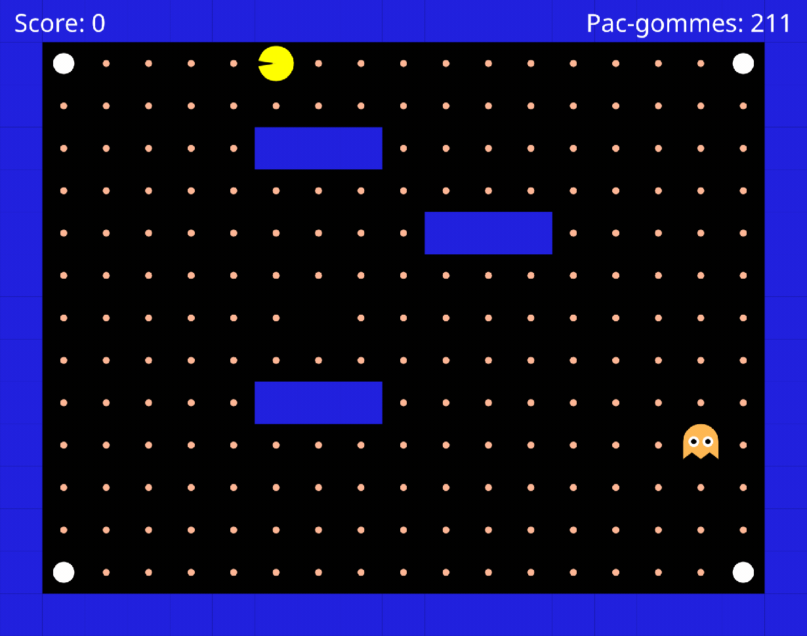

<!-- ws: {type: hint} -->
<details><summary>Si tu es bloqué</summary>

- **Coupe l'étape en deux, teste au milieu.**
  - *Moitié 1, la couleur seule.* Écris seulement tes deux flèches, puis mange une grosse pac-gomme blanche : le fantôme doit passer au bleu. Il continue à te poursuivre, c'est normal, aucune règle ne regarde encore ce mode.
  - *Moitié 2, la fuite.* Ajoute le bloc `scared`.
- Tu peux utiliser `print(game.scaredTimer)` ou `print(state)` au début de `ghost` et regarder le panneau **Console** pour t'aider à comprendre ce que fait ton code.
- Essaye de bien te rappeler ce que signifie :
  - `distanceX > 0` et `distanceX < 0` : voir l'étape 3 de la partie 1
  - `distanceY > 0` et `distanceY < 0` : voir l'étape 5 de la partie 1

</details>

Le fantôme ne bouge plus quand il a peur ? Il est peut-être acculé : toutes les directions libres le rapprochent de toi, donc aucune de tes règles ne s'applique :

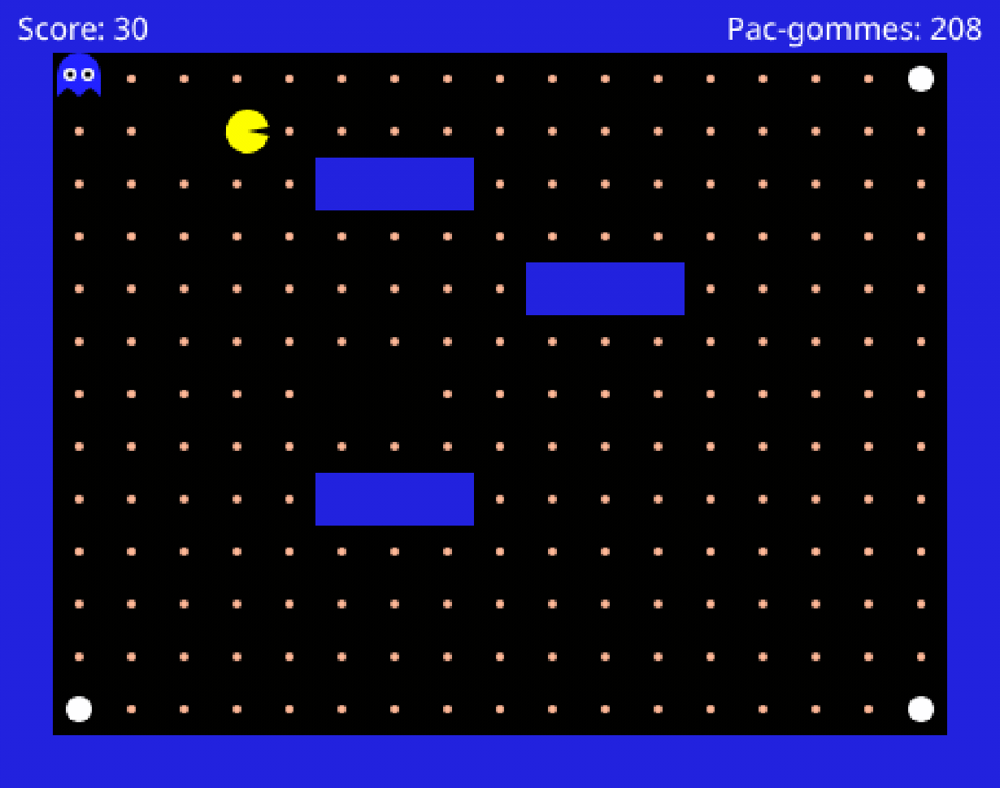

Que **devrait** faire ton code dans ce cas ? Il n'y a pas une seule bonne réponse, et c'est toi qui décides : rester immobile et se faire manger, prendre quand même la case la moins mauvaise, ou repartir en patrouille. Tu pourras gérer ce cas spécifique s'il te reste du temps à la fin de cet atelier.

## Étape 2 : Errer au hasard
<!-- ws: {type: exercise, id: a2-patrouiller} -->

En `'patrol'`, le fantôme ne te cherche pas. À chaque case, il regarde les directions libres et en tire une au hasard.

Ça donne un fantôme qui **ne va nulle part en particulier** : il tourne autour de son point de départ au lieu de traverser la carte. C'est ce que veut dire « au hasard », et c'est exactement ce qu'on veut voir ici.

### Boîte à outils

> 🧰 **Outil #1 : construire une liste petit à petit**
> `{}` crée une liste vide, `table.insert` y ajoute un élément à la fin.
> ```lua
> glaceDispo = true
> gateauDispo = false
> cookieDispo = true
> desserts = {}
> if glaceDispo then table.insert(desserts, 'glace') end
> if gateauDispo then table.insert(desserts, 'gâteau') end
> if cookieDispo then table.insert(desserts, 'cookie') end
> ```
> Tape ensuite `desserts[1]` dans la **Console** : tu lis `glace`.
> 📘 [table.insert](https://www.lua.org/manual/5.3/manual.html#pdf-table.insert)

> 🧰 **Outil #2 : tirer au hasard dans une liste**
> `#liste` donne le nombre d'éléments, `math.random(1, n)` tire un entier entre 1 et n inclus.
> À taper juste après l'outil #1 : il se sert du `desserts` que tu viens de construire.
> ```lua
> index = math.random(1, #desserts)
> return desserts[index]
> ```
> **En Lua, les listes commencent à 1**, pas à 0.
> 📘 [math.random](https://www.lua.org/manual/5.3/manual.html#pdf-math.random) · [l'opérateur #](https://www.lua.org/manual/5.3/manual.html#3.4.7)

### 🥸 Mise en application

**Ton objectif :** un fantôme qui erre sans te chercher, et qui ne traverse aucun mur.

Un bloc `if state == 'patrol' then`, entre le bloc `scared` que tu viens d'écrire et tes règles de poursuite. Dedans :

1. construis la liste des directions libres, en te servant des `canGo...` que tu as depuis la partie 1
   - Tu peux appeler ta liste `possibleDirections`
2. tires-en une au hasard, et renvoie-la

Tu dois obtenir ceci : il erre sans traverser un seul mur, et il ne te poursuit plus du tout, même collé à toi. C'est voulu et c'est temporaire : la poursuite revient à l'étape 3, en mieux.

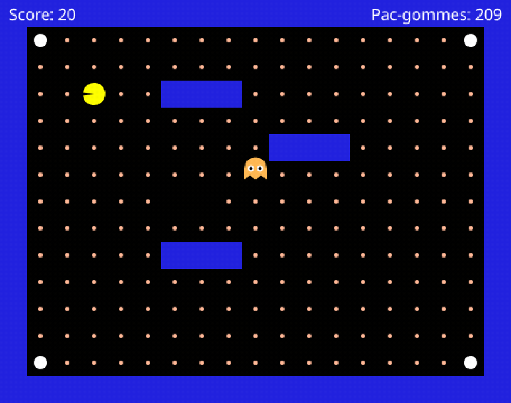

<!-- ws: {type: hint} -->
<details><summary>Si tu es bloqué</summary>

- **Ta liste se construit-elle ?** `print(#possibleDirections)` juste avant le tirage, et regarde le panneau **Console**, sous l'éditeur. Si le nombre reste à 0, le problème est dans la construction de ta liste, pas dans le tirage. (Et tu risques d'avoir une erreur qui s'affiche.)
- **Il te poursuit encore, comme avant ?** Alors ton bloc `patrol` n'est jamais atteint : vérifie que `state = 'patrol'` est bien en haut de ton fichier (étape 0), et que ton bloc s'écrit `state == 'patrol'`, avec deux `=`.
- **Il traverse les murs ?** Tu as mis les quatre directions dans la liste sans les filtrer. Seules les libres y entrent.

</details>

## Étape 3 : Poursuivre seulement quand tu es proche
<!-- ws: {type: exercise, id: a2-mode-follow} -->

Tu tiens les trois comportements, et les deux flèches de `'scared'`. Il te manque les deux qui relient `'patrol'` et `'follow'` : proche fait passer en `'follow'`, loin ramène en `'patrol'`.

« Proche » se mesure en **cases** : l'écart horizontal **plus** l'écart vertical. Le seuil de cette partie est **5 cases**.

### Boîte à outils

> 🧰 **Outil #1 : `math.abs` retire le signe**
> ```lua
> print(math.abs(5))    -- 5
> print(math.abs(-5))   -- 5
> ```
> Que Pac-Man soit trois cases à gauche ou trois cases à droite, il est à trois cases.
> *(Si tu as fait l'étape 7 de la partie 1, tu le connais déjà.)*
> 📘 [math.abs](https://www.lua.org/manual/5.3/manual.html#pdf-math.abs)

> 🧰 **Outil #2 : `<=` « plus petit ou égal »**
> `a < b` est faux quand `a` vaut exactement `b`. `a <= b` est vrai dans ce cas.
> ```lua
> age = 15
> if age <= 17 then
>   return 'tarif jeune'
> end
> ```
> 📘 [Les opérateurs de comparaison](https://www.lua.org/manual/5.3/manual.html#3.4.4)

> 🧰 **Outil #3 : écrire une flèche du diagramme**
> Une flèche a trois morceaux : **d'où** elle part, **quand** elle part, et **vers où** elle va.
> ```lua
> humeur = 'calme'
> bruit = 80
> if humeur == 'calme' and bruit > 50 then
>   humeur = 'agacé'
> end
> ```
> Tape ensuite `humeur` dans la **Console** : tu lis `agacé`.
> D'où : `humeur == 'calme'`. Quand : `bruit > 50`. Vers où : `humeur = 'agacé'`.
> Une flèche qui part de **n'importe quel** mode ne teste pas `humeur` : elle n'a que le « quand ».

### 🥸 Mise en application

**Ton objectif :** un fantôme qui patrouille quand tu t'éloignes, et te repère quand tu reviens.

Tout se joue dans tes flèches. Tes règles de déplacement ne changent pas : ton arbre de la partie 1 est déjà ce que fait le fantôme quand il n'est ni `scared` ni `patrol`.

1. une variable `totalDistance` qui vaut la distance en cases
2. les deux flèches qui manquent : celle qui part de `'patrol'` quand `totalDistance` descend à 5 ou moins, et celle du retour, qui part de `'follow'` quand tu t'éloignes

Tu dois obtenir ceci : **orange** de loin, **rouge** à 5 cases ou moins, orange à nouveau quand tu t'éloignes. En rouge, le jeu le fait aussi accélérer un peu : ça ne vient pas de ton code.

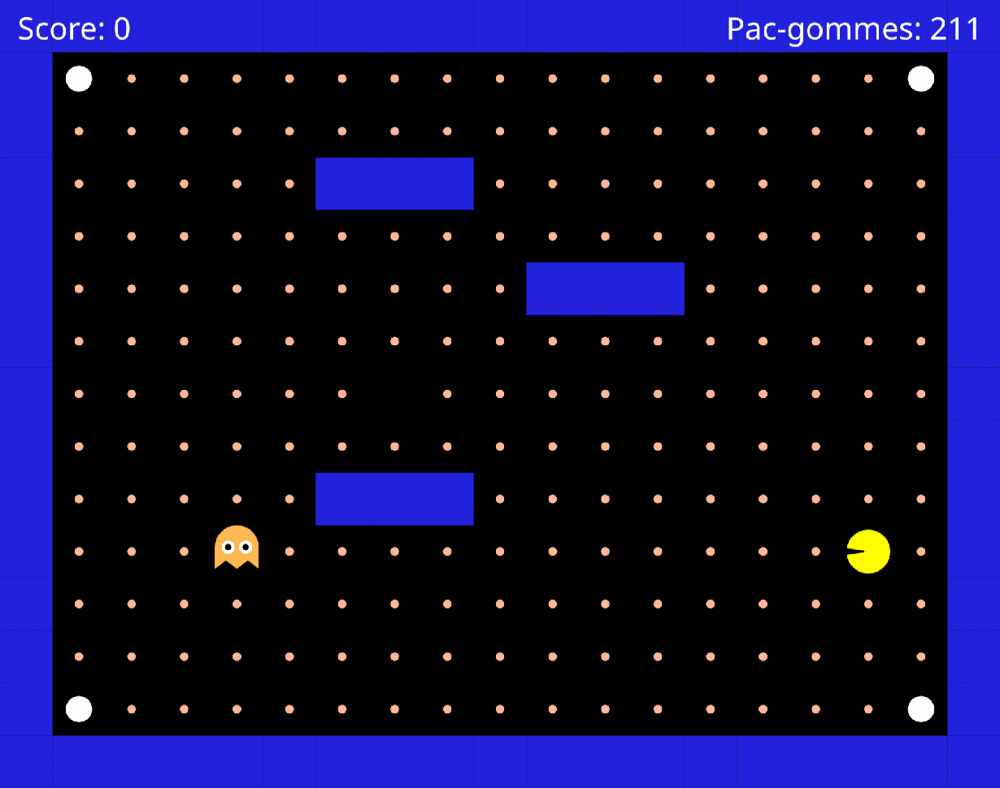

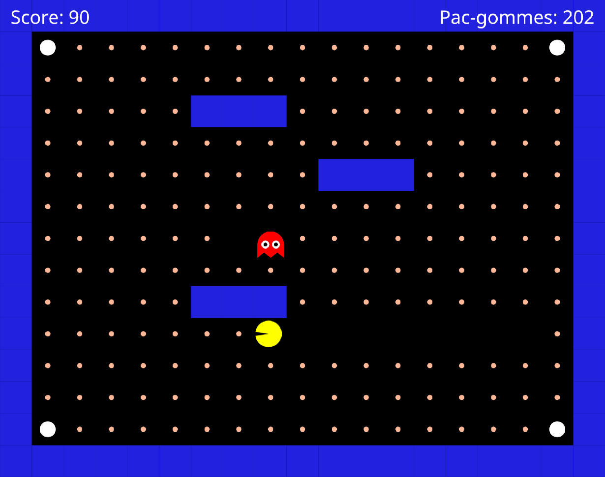

<!-- ws: {type: hint} -->
<details><summary>Si tu es bloqué</summary>

Orange en permanence ? `print(totalDistance)` juste après l'avoir calculée, et regarde le panneau **Console** : en te rapprochant, le nombre doit descendre vers 0 en restant **positif**. S'il devient négatif, il te manque la valeur absolue.

Rouge en permanence ? Il te manque la flèche du retour : il entre en `'follow'` et rien ne l'en fait ressortir.

Plus jamais bleu quand il est rouge ? Ta flèche vers `'scared'` part sûrement de `'patrol'` seulement. Sur le diagramme elle part **des deux** modes : elle ne teste pas `state`, seulement `game.scaredTimer`.

Rouge mais immobile ? Ton arbre de la partie 1 est resté **dans** le bloc `patrol`, au lieu d'être à côté.

</details>

## Étape 4 : Le fantôme complet
<!-- ws: {type: exercise, id: a2-fantome-complet} -->

Tes trois modes existent séparément. Reste à voir s'ils s'enchaînent proprement.

### 🥸 Mise en application

**Ton objectif :** retrouver les six comportements ci-dessous. Pas besoin de finir la partie, tu provoques chaque situation exprès, en deux minutes.

| Ce que tu fais | Ce que tu dois voir |
| --- | --- |
| Tu restes à l'autre bout de la carte | **orange**, il erre au hasard sans te chercher |
| Tu approches à 5 cases ou moins | **rouge**, il accélère et fonce sur toi |
| Tu manges une grosse pac-gomme blanche | **bleu**, il s'écarte pendant 8 s |
| Tu le touches en bleu | tu l'attrapes : il repart à l'autre bout de la carte, à moitié effacé, et reprend sa couleur en arrivant |
| Tu le touches en orange ou rouge | tu meurs, ça redémarre après 3 s |
| À tout moment | il ne traverse aucun mur |

Et si tu veux la gagner en entier, 211 pac-gommes et un score de **2 270**, c'est bien plus dur avec ce fantôme-là qu'à la partie 1 :

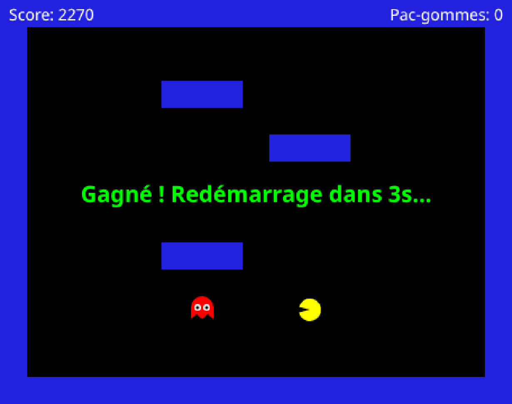

> 💡 **Tu n'as pas fini les étapes précédentes ?** Va quand même voir le bonus **Ton fantôme à toi** : deux modes qui s'enchaînent se règlent aussi bien que trois.

<!-- ws: {type: hint} -->
<details><summary>Si tu es bloqué</summary>

Un mode ne se déclenche jamais ? Reviens à l'étape qui l'a introduit et refais sa **Mise en application.**

</details>

## Bonus : Tenir sa direction
<!-- ws: {type: exercise, id: a2-tenir-direction, optional: true} -->

Ton fantôme erre, mais il ne va nulle part : à chaque case il retire une direction, et une fois sur quatre c'est un demi-tour. Il tourne autour de son point de départ.

Il lui faut garder sa direction quelques cases au lieu de changer à chacune. Ces cases, c'est toi qui vas les compter : le jeu appelle `ghost` **à chaque case**, donc compter les appels, c'est compter les cases.

Deux outils : `me.direction`, la direction que le fantôme suit en ce moment, et une variable à toi, `compteur`, qui augmente de 1 à chaque appel.

La règle à poser **avant** ton tirage au hasard : si `compteur < 5` **et** que la case devant est libre, continue dans `me.direction`. Sinon, remets `compteur` à 0 et tire.

### Boîte à outils

> 🧰 **Outil #1 : une variable qui survit d'un appel à l'autre**
> Une variable créée **en dehors** de la fonction garde sa valeur entre deux appels. Dedans, elle repartirait de zéro à chaque fois.
> ```lua
> nombreDeVisites = 0
> function visite()
>   nombreDeVisites = nombreDeVisites + 1
> end
> ```
> Appelle `visite()` trois fois dans la **Console**, puis tape `nombreDeVisites` : tu lis `3`.
> 📘 [Les variables](https://www.lua.org/manual/5.3/manual.html#3.2)

> 🧰 **Outil #2 : aller d'un mot à la bonne réponse**
> Tu as un mot d'un côté (`'left'`), et des réponses aux noms différents de l'autre (`canGoLeft`...). Le plus direct est de poser la question cas par cas :
> ```lua
> animal = 'chat'
> leChienAboie = 'ouaf'
> leChatMiaule = 'miaou'
> if animal == 'chien' then return leChienAboie end
> if animal == 'chat'  then return leChatMiaule end
> ```
> *(Il existe plus court, si tu ranges tes réponses autrement. Cherche, si ça t'amuse.)*

### 🥸 Mise en application

**Ton objectif :** un fantôme qui tient sa direction cinq cases d'affilée, et qui traverse donc vraiment la carte.

1. En haut du fichier, à côté de `state` : `compteur = 0`
2. Dans ton bloc `patrol`, la règle ci-dessus **avant** le tirage au hasard, et `compteur = compteur + 1` juste avant elle

`me.direction` vaut `'left'`, `'right'`, `'up'`, `'down'`, ou `nil` au premier appel et quand il est arrêté.

Tu dois obtenir ceci :

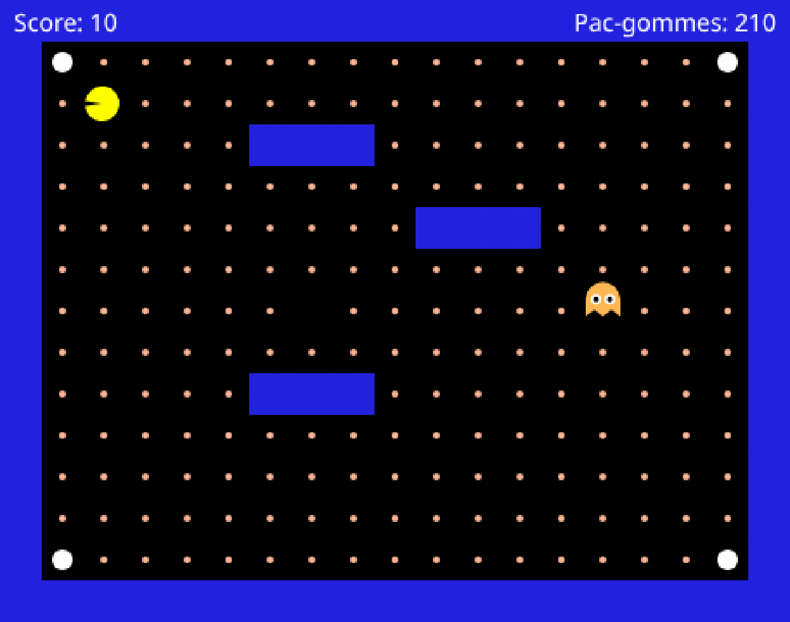

*C'est réussi si :* il file en ligne droite sur plusieurs cases avant de tourner, et qu'en vingt secondes il s'est vraiment éloigné de son point de départ.

## Bonus : Ton fantôme à toi
<!-- ws: {type: exercise, id: a2-ton-fantome, optional: true} -->

*Tu es arrivé au bout, les trois modes s'enchaînent. Ce qui suit n'est plus un exercice : c'est ta récompense, et c'est la partie que personne ne fait pareil.*

Ton fantôme marche, mais ses réglages sont ceux qu'on t'a donnés. Son caractère tient dans ces trois lignes du tableau : deux nombres et un ordre :

| Ce que tu changes | Ce que ça donne |
| --- | --- |
| le seuil des 5 cases | un fantôme myope, ou un qui te repère de l'autre bout de la carte |
| l'ordre des règles dans `follow` | poursuivre ou essayer de te couper la route |
| le nombre auquel tu compares `compteur`, si tu as fait le bonus **Tenir sa direction** | `5` le laisse tenir cinq cases ; `2` le fait tourner deux fois plus souvent |

Un seul de ces nombres suffit à changer son caractère. Même trajet de Pac-Man, deux fantômes opposés :

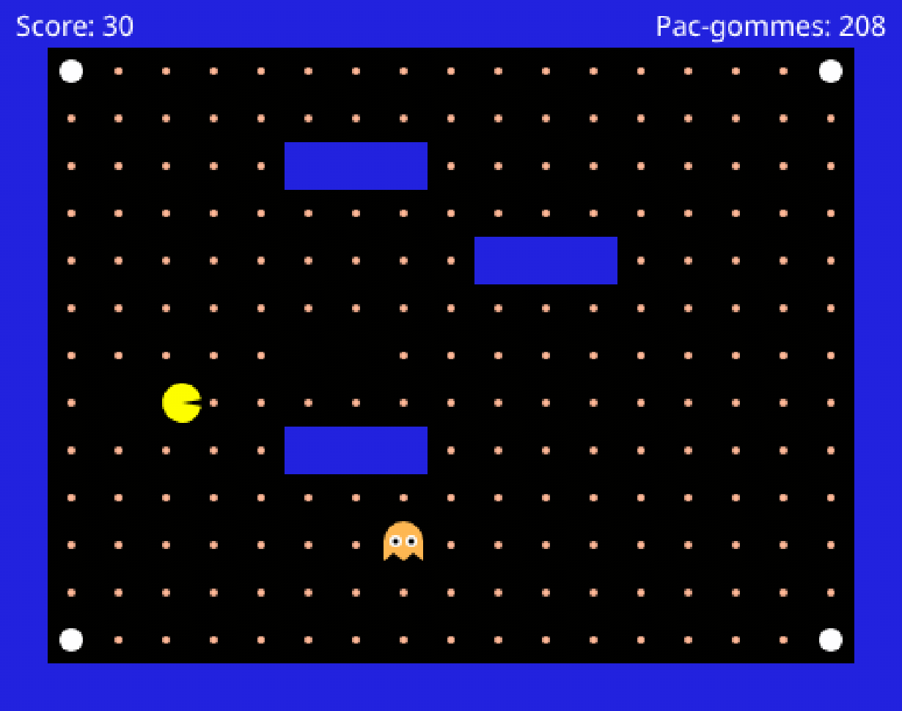

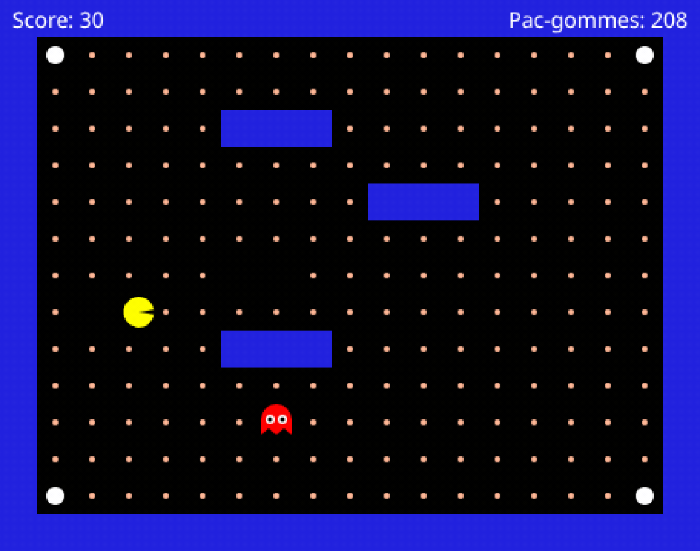

### 🥸 Mise en application

**Ton objectif :** un fantôme qui te ressemble, et une partie jouée contre lui.

1. Écris son caractère en trois phrases, **en français**. Par exemple : *« Il ne me voit que de très près. Mais dès qu'il me voit, il coupe au plus court. Et il ne lâche plus. »*
2. Traduis chaque phrase en un réglage, et donne-lui un nom.
3. Lance, joue trente secondes : ta description se vérifie-t-elle à l'écran ?

Puis joue contre lui.

> 🎯 **Ton score de survie.** Joue jusqu'à ce qu'il t'attrape : le **Score** affiché quand « Perdu ! » apparaît, c'est ce que tu as ramassé avant qu'il te tombe dessus. Plus il est bas, plus ton fantôme t'a mené la vie dure. Cela va te permettre d'équilibrer ton jeu pour qu'il ne soit ni trop dur ni trop facile.

Note-le, change **un** réglage, rejoue. Trois fois.

| Essai | Ce que j'ai changé | Mon score de survie |
| --- | --- | --- |
| 1 | (les réglages de la partie) | |
| 2 | | |
| 3 | | |

C'est réussi quand tu sais dire **lequel des trois réglages** a rendu ton fantôme plus dur.

<!-- ws: {type: hint} -->
<details><summary>Si tu es bloqué</summary>

Tu ne vois pas quoi changer ? Prends le seuil, et uniquement lui. Mets-le à `2`, joue trente secondes. Mets-le à `30`, rejoue.

Ton fantôme ne ressemble pas à ta description ? Change **un** réglage à la fois et relance entre chaque. À deux changements d'un coup, on ne sait plus lequel a fait quoi.

</details>

## Défis bonus - Partie 2
<!-- ws: {type: exercise, id: a2-bonus, optional: true} -->

Trois variantes de ta machine à états.

### Défi #1 : L'opportuniste

Dans ta flèche de sortie de `'scared'`, ne le laisse pas avoir peur jusqu'au bout : dès que `game.scaredTimer` descend sous 2, remets-le en chasse sans attendre la fin des 8 secondes.

*C'est réussi si :* il repasse au rouge **avant** que la super pac-gomme soit épuisée.

### Défi #2 : Le fantôme rancunier

En `scared`, ne fuis que si tu es proche : au-delà de 10 cases, il n'a plus peur de toi et repart en patrouille, même bleu.

*C'est réussi si :* colle-toi à lui, il s'écarte ; éloigne-toi de dix cases, il se remet à errer au hasard sans t'éviter.

### Défi #3 : Le fantôme imprévisible

Combine les deux modes : en `patrol`, fais-le foncer sur toi une fois de temps en temps, au hasard, même si tu es loin.

*C'est réussi si :* il t'arrive de le voir charger depuis l'autre bout de la carte.

## Fin de la partie 2

Ton fantôme sait patrouiller, poursuivre et prendre peur. Trois humeurs, trois couleurs, et c'est toi qui as écrit les règles de chacune.

Tu as utilisé deux façons de programmer un comportement : un arbre de décision, puis une **machine à états**. Ce qui sépare les deux tient dans un seul mot, `state` : ton fantôme se souvient de ce qu'il est en train de faire, et c'est ce souvenir qui décide de la suite.
