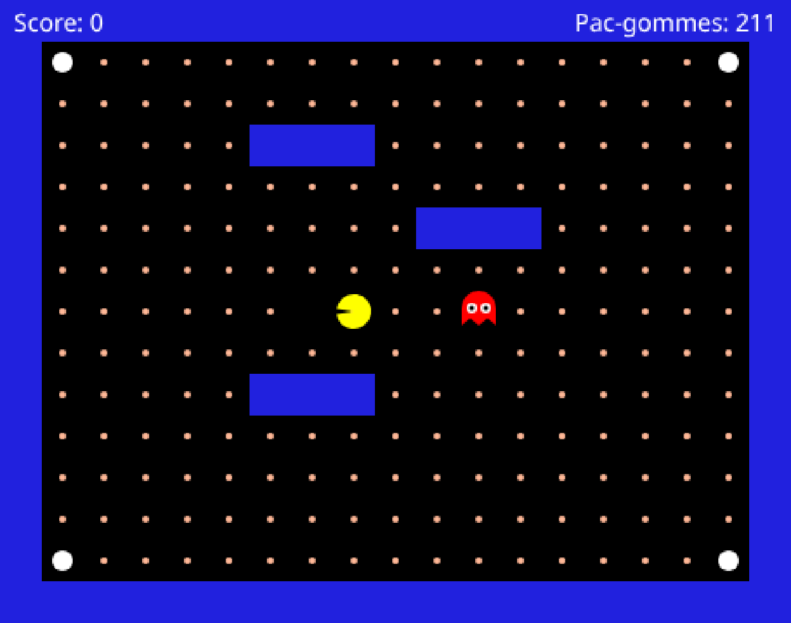

# IA du fantôme de Pac-Man

Dans le Pac-Man de 1980, les fantômes n’ont pas tous le même caractère. Blinky fonce droit sur
toi. Pinky vise la case *devant* toi pour te couper la route. Clyde te suit, puis file dans son
coin dès qu’il s’approche trop. Rien de tout ça n’est du hasard : quelqu’un l’a écrit, règle par
règle.

Aujourd’hui, c’est toi.



**Dans une demi-heure, le fantôme bougera parce que tu le lui auras dit.**

Et à la fin, tu lui donneras un **caractère** à toi, et un nom.

**Deux ateliers de 2 h 30**, en **Lua**, un langage de programmation. Rien à installer, aucun
compte à créer, et ton code est sauvegardé tout seul.

- **Atelier 1 — Arbre de décision.** Des règles « si… alors… », dans un ordre qui compte, et
  un fantôme qui poursuit.
- **Atelier 2 — Machine à états finis.** Trois modes — `patrol`, `follow`, `scared` — et un
  fantôme qui change d’humeur.

<details><summary><b>Quand tu bloques</b> — quoi faire, selon le temps que tu as perdu</summary>

Personne ne finit un atelier sans se coincer au moins une fois.

| Depuis quand tu bloques | Ce que tu fais |
| --- | --- |
| 2 minutes | relis le **Tu dois obtenir ceci** de l’étape et compare avec ton écran |
| 5 minutes | lis le texte rouge sous l’éditeur **en entier** : il donne la ligne, et le mot qui coince |
| 10 minutes | ouvre l’indice de l’étape s’il y en a un, et affiche tes variables avec `print` : le texte sort dans la console du navigateur (**F12**, onglet **Console**) |
| 15 minutes | explique ton problème à voix haute, mot à mot : c’est en le disant qu’on entend ce qui manque |
| 20 minutes | **copie ton code dans un fichier à côté**, puis essaie autre chose : tu pourras toujours revenir à la version qui marchait |
| c’est le chaos | recolle le fichier de départ — il est plus bas. **Tu repars de zéro** : copie ton code actuel dans un coin avant |

</details>

<details><summary><b>Garder une trace</b> — la capture d’écran, sur ton ordinateur</summary>

À la fin de chaque atelier, garde une capture de ton écran — c’est ta trace à toi. Une seule
touche :

| Ton ordinateur | Pour capturer l’écran |
| --- | --- |
| Windows 10 / 11 | **Windows + Maj + S**, puis sélectionne le panneau Jeu |
| Mac | **Cmd + Maj + 4**, puis sélectionne le panneau Jeu |
| Si rien ne marche | prends le jeu en photo avec ton téléphone |

</details>

<details><summary><b>Le fichier de départ</b> — à recoller si ton code devient illisible</summary>

Les trois fonctions telles qu’elles étaient à la première seconde. Aucune réponse dedans.

```lua
function buildInfos(ghost, pacman, map)
  return {}
end

function chooseDirection(infos, map)
  return nil
end

function updateState(infos, game)
  return 'patrol'
end
```

</details>

<details><summary><b>Ce que le jeu te donne</b> — les noms qui viennent du jeu, pas de Lua</summary>

| Terme | Signification |
| --- | --- |
| `buildInfos` | Fonction où tu construis la table `infos` : les réponses que tu prépares pour le fantôme |
| `chooseDirection` | Fonction où tu écris les règles « si… alors… » qui choisissent une direction |
| `updateState` | Fonction qui choisit l’humeur du fantôme (atelier 2) |
| `ghost.gridX / gridY` | Position du fantôme, en cases |
| `pacman.gridX / gridY` | Position de Pac-Man, en cases |
| `map.isWall(x, y)` | `true` si la case `(x, y)` est un mur |
| `'left'` `'right'` `'up'` `'down'` | Les quatre directions que le jeu comprend. Toujours en anglais, toujours entre apostrophes |

Tout le reste est expliqué dans les **boîtes à outils**, à l’étape où tu en as besoin. Leur 📘
mène au manuel de Lua, **qui n’existe qu’en anglais** : vas-y pour l’exemple de code.

</details>
