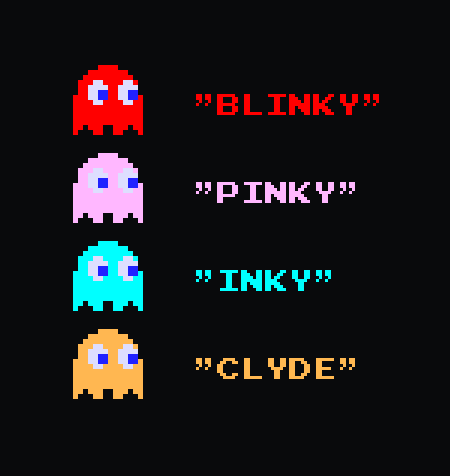
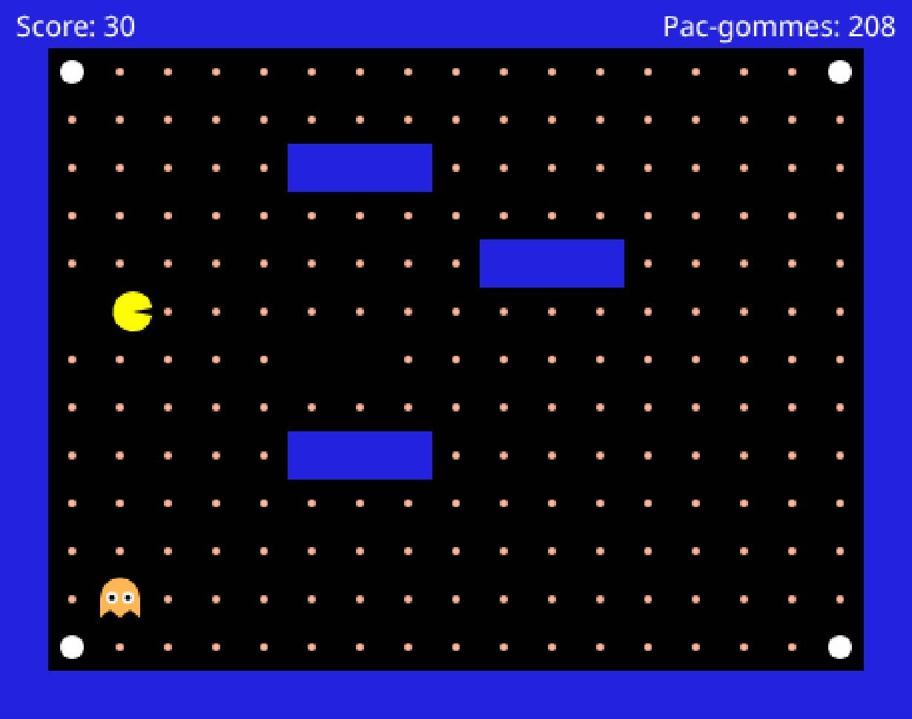

# IA du fantôme de Pac-Man

Dans le Pac-Man original, les quatre fantômes n'ont pas tous le même caractère. Blinky fonce droit sur
toi. Pinky vise la case *devant* toi pour te couper la route. Clyde te suit, puis file dans son
coin dès qu'il s'approche trop. Inky, lui, se décide en regardant où est Blinky.



Rien de tout ça n'est du hasard : quelqu'un l'a écrit, règle par règle.

Aujourd'hui c'est toi qui vas ré-écrire ces règles pour donner vie à ton premier PNJ.



**Bientôt c'est TON code qui fera bouger ce fantôme**

Et à la fin, tu en auras fait un vrai chasseur.

**Deux parties**, tu codes en **Lua**, un langage de programmation bien pratique pour développer des petits jeux vidéo. Rien à installer, tout se fait dans ton navigateur.

- **Partie 1 : Arbre de décision.** Des règles « si... alors... » afin d'avoir un fantôme qui poursuit.
- **Partie 2 : Machine à états finis.** Pour avoir un fantôme qui change d'humeur.

## Le fichier de départ

À utiliser si tu veux repartir de zéro.

```lua
function ghost()
  return nil
end
```

## Ce que le jeu te donne

Ces termes viennent du jeu, pas de Lua.

| Terme | Signification |
| --- | --- |
| `ghost` | La fonction où tu écris les règles « si... alors... » du fantôme. Le jeu l'appelle **à chaque case** : quand le fantôme arrive au centre d'une case, il part dans la direction qu'elle renvoie |
| `me.X` `me.Y` | Position du fantôme (X,Y), en cases |
| `pacman.X` `pacman.Y` | Position de Pac-Man (X,Y), en cases |
| `map.isWall(x, y)` | `true` si la case `(x, y)` est un mur |
| `'left'` `'right'` `'up'` `'down'` | Les quatre directions que le jeu comprend. Toujours en anglais, toujours entre apostrophes |
